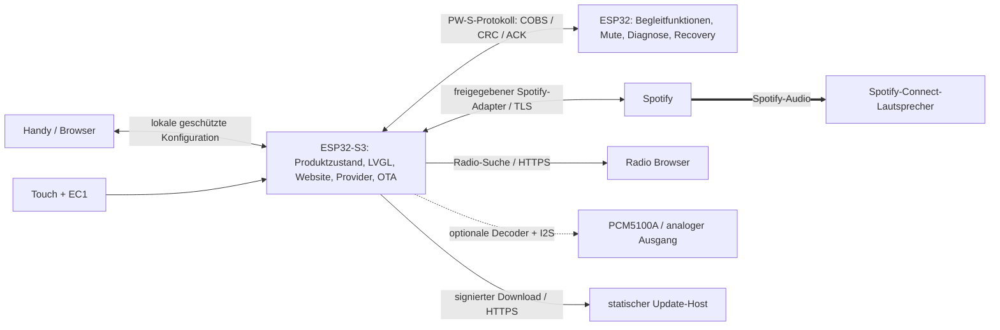

# Gesamtkonzept

Stand 2026-09-30. Verbindlicher Nutzerwunsch: Produkt für weitere Nutzer, Spotify auf Connect-Lautsprechern, Konfiguration im RotaryKnob, optional Klinke, Radio-Liste, OTA; keine HA-/MA-Abhängigkeit. Dieses Dokument beschreibt den Zielzustand. Implementiert sind bisher nur Verträge, Referenzmodelle und Webentwurf.

## 1. Produkt und Grenzen

Ein vorkonfiguriertes Gerät wird mit Strom versorgt, mit dem WLAN und einem Spotify-Konto verbunden, einem Lautsprecher zugeordnet und mit wenigen Favoriten bestückt. Danach reichen Drehen und Touch zur alltäglichen Bedienung. Telefon/Computer ist nach erfolgreicher Einrichtung für den Regelbetrieb nicht erforderlich; Spotify und der Connect-Lautsprecher brauchen Internet. Werkzeuge, YAML, persönliche Entwicklerkonten und Token-Kopieren sind kein vorgesehener Kundenweg.

| Funktion | Ziel | Bedingung |
| --- | --- | --- |
| Spotify auf vorhandenem Connect-Lautsprecher | Kernfunktion | Produktgenehmigung und geeigneter offizieller Controller-Zugang müssen zuerst belegt werden |
| Play/Pause, Titelwechsel, Lautstärke, Fortschritt, Cover | Kernfunktion | Capability des Zielgeräts und zugelassener Schnittstelle |
| Freigegebene Playlists und Podcasts | Kernfunktion | Verlinken/aus Spotify übernehmen; keine eigene Spotify-Suche ohne passende Freigabe |
| Lokale Konfigurationswebsite | Kernfunktion | Alle Einstellungen und Favoriten auf dem Gerät |
| Zwei-Prozessor-OTA über Website | Kernfunktion | Signierte Images, Speicher- und Rollback-Nachweis |
| Radio-Liste aus Radio Browser oder eigener URL | Bestandteil der Konfiguration | Wiedergabe verlangt einen separaten geeigneten Ausgabepfad und Produktfreigabe |
| Radio über normalen Spotify-Connect-Endpunkt | Nicht als Fähigkeit zugesagt | Connect akzeptiert keine beliebigen Internetradio-URLs |
| Kopfhörer am Onboard-Anschluss | Optionaler Versuch | Pin-/Boardrevision, Ausgangslast und gegebenenfalls Verstärker prüfen |
| Spotify-Audio direkt am Gerät | Eigenes optionales Teilprojekt | Lizenzierter Embedded-Player, SDK-Port, Ressourcen, Zertifizierung; Web API liefert kein Audio |

Es gibt eine Favoritenfreigabe **innerhalb der RotaryKnob-Oberfläche**. Sie sperrt nicht das Spotify-Konto oder die originale Spotify-App und ist keine verbindliche Kindersicherung. Kontoübergreifende Rechte, explizite Inhalte und Marktbeschränkungen bleiben bei Spotify.

## 2. Architekturentscheidung

Der ESP32-S3 mit 16 MB Flash und 8 MB PSRAM wird Produktcontroller und Webhost. Der classic ESP32 hat nach aktueller Konfiguration 4 MB Flash ohne PSRAM und bleibt Begleitprozessor. Die bisherige Netzwerk-Bridge muss daher nicht sämtliche TLS-, JSON- und Weblast übernehmen. Ein früher Belastungstest muss zeigen, dass UI und Netzwerk auf dem S3 gleichzeitig ihre Budgets einhalten. SDK-Unterstützung ist dadurch nicht automatisch gegeben.

Die Verbindung Spotify → Lautsprecher ist der Audioweg. Der Controller leitet diese Audiodaten nicht weiter. Ein zusätzliches DAC-Audioprojekt nutzt eine eigene Pipeline. Kein ESP32-Web-Playback-SDK, kein Audio-Download über Web API, keine inoffizielle Connect-Emulation als Produktgrundlage.

### Verantwortlichkeiten

| Modul | Verantwortung | Daten / Ereignisse |
| --- | --- | --- |
| `product_core` | Einziger serialisierter fachlicher Zustand, Konfigurationsrevision, Fehlerzustände | `DeviceState`, `ConfigRevision`, Befehls-ID und Generation |
| `input_ui` | EC1-Pulserkennung, Touch, sofortige visuelle Rückmeldung, UI-Zustand | kleine gebundene Befehle, keine Netzaufrufe im UI-Thread |
| `spotify_provider` | Zugelassene Spotify-Identität und Fähigkeiten, Status und Aktionen | abstraktes `MediaProvider`; Produktadapter erst nach Gate G0 |
| `catalog` | Freigegebene Favoriten, Reihenfolge, Paginierung, lokale Bezeichnungen | Playlists, Shows, Episoden, Radioeinträge |
| `web_admin` | Lokale statische Assets, Konfigurations-API, Sitzungen, Job-Fortschritt | Keine Tokens/Passwörter über GET oder Export |
| `credentials` | Geräteschlüssel und Provider-Credentials | verschlüsselter nicht exportierbarer Speicher |
| `network` | Ein WLAN-Client auf S3, Setup-AP, Zeit, DNS, mDNS, TLS | `offline`, `connecting`, `online`, `captive_network` |
| `assets` | Begrenzter Coverdownload und asynchrone Dekodierung | sequenzgebundener flüchtiger Cache |
| `uart_peer` | Versionen, Peer-Gesundheit, Mute, Updatechunks | gebundene Frames, Prioritäten, Resume, keine beliebigen Kommandos |
| `ota_manager` | Eine Transaktion für beide Chips | Journal, Vorprüfung, Signatur, Healthcheck, Recovery |
| `radio_provider` | Datenbanksuche und URL-Verwaltung; optional Radio-Audio | capability-geprüfter Ausgabepfad |

## 3. Firmwarebasis und Wiederverwendung

Zielplattform ist ESP-IDF mit getrennten Anwendungen für S3 und ESP32 und einem gemeinsam getesteten Protokollkern. ESPHome ist keine notwendige Laufzeitabhängigkeit; der bisherige ESPHome-Quellcode dient als nachweisbare Portierungsquelle. Die Übernahme von LVGL-UI und Displayinitialisierung ist ein echtes Arbeitspaket, kein unveränderter Headerimport. Toolchain, LVGL-Major und Displaytreiber werden erst nach Build-/Speicher-Spike gemeinsam fixiert; keine fiktive aktuelle Versionsnummer.

Übernommen werden Bedienverhalten, Display-/Touchparameter, Pulszählung, Haptik, Priorisierung, atomare Medienanzeige, Paginierung und bewährte Fehlerfälle. Entfernt werden HA-Entitäten, Native API, Music-Assistant-Aufrufe, Haus-/Licht-/Wetterdaten und fremde Kundeneinstellungen. Wetter, Timer und Smarthome-Seiten gehören nicht zum Spotify-Produktumfang; Uhr/Standby können lokal bleiben.

### Bedienung

- Startansicht: Titel, Interpret oder Podcast, Fortschritt, Lautsprecher und Lautstärke.
- Drehen: Lautstärke; im geöffneten Favoriten-/Gerätemenü bewegen.
- Touch: Play/Pause, vorheriger/nächster Titel oder Episode, Favoriten, Lautsprecher, Einstellungen.
- Keinen Ring-Druckschalter voraussetzen: Im auditierbaren Profil ist kein solcher Eingabepfad belegt.
- Fehlende Fähigkeiten deaktivieren die zugehörigen Aktionen mit Erklärung; niemals still auf ein anderes Zimmer wechseln.
- Bei Geräteverlust: Auswahl behalten, als nicht erreichbar anzeigen, erneute Auswahl oder kurze Anleitung zum Aktivieren in Spotify.
- Lautstärke optimistisch darstellen; autoritative Bestätigung übernimmt den tatsächlichen Wert. Obergrenze begrenzt Knob-Kommandos, nicht andere Spotify-Clients.
- Sichtbare Spotify-Zuordnung und erlaubte Metadaten-/Coverdarstellung nach freigegebenen Designregeln; Cover nicht beliebig zuschneiden wie bisherige Vollbild-Überscan-Lösung.

## 4. Daten, Parallelität und Ressourcen

Ein Actor/Eventloop besitzt den Produktzustand; Web- und Drehbefehle laufen durch dieselbe Warteschlange. Lautstärkebefehle werden mit 150–250 ms Startwert zusammengefasst (messbar abstimmen), absolute Werte bevorzugt. Next/Previous werden nach Timeout nicht blind wiederholt. Nur ein Provider-Aufruf pro Steuersequenz; neuere Auswahl supersediert alte, ohne deren verspätete Antworten zu übernehmen. Playback wird nach Provider-Bestätigung als tatsächlich gestartet dargestellt, nicht bereits nach HTTP-Akzeptanz.

Metadaten bilden atomare Snapshots mit Sitzung + monotoner Generation + Track-/Episode-ID. Cover gehört zu genau dieser Generation. Ersetzte Downloads werden verworfen. Fortschritt wird aus einem bestätigten Zeitstempel lokal interpoliert; API-Polling ist adaptiv, z.B. aktiv 3–5 s, ruhig 15–30 s, Hintergrund 60 s als zu messende Anfangswerte. Nach eigenen Aktionen begrenzte unmittelbare Statusabfrage. Keine offizielle Push-Verbindung erfinden. SDK-Ereignisse können Polling ersetzen, wenn freigegeben.

Vorgeschlagene Startlimits: 64 Spotify-Favoriten, 64 Radioeinträge, 20 Zeilen pro Geräteansicht, maximal 256 KiB komprimiertes Cover, höchstens drei HTTP-Weiterleitungen, Downloadzeit/Größe/MIME und Bildabmessungen begrenzen. Die eigentliche Spotify-Pagination folgt dem genehmigten API-Profil (Development ggf. 10 Suchergebnisse), nicht einem universellen Limit. Spätere Grenzwerterhöhungen benötigen Heap-/Latenznachweis.

Webassets ohne CDN, Frameworklaufzeit, Tracker oder externe Schriftdateien, vorab gzip-komprimiert. Zielbudget höchstens 256 KiB komprimiert. Zwei gleichzeitige TLS-Verbindungen als Anfangsobergrenze, kleine Streamingparser statt vollständiger Bibliothekskopien. DMA-Puffer in internem RAM, Bilder/Kataloge in PSRAM. Belegungsgrenzen sind Gate G1; Espressif/Spotify können Anforderungen ändern.

## 5. Produktbetrieb und Wartung

Hersteller flasht beide Chips und hinterlegt eine gemeinsame Produktidentität sowie individuelle Gerätezugänge. Kunden richten ein fertiges, unkonfiguriertes Gerät ein. USB-Erstflash beider Chips ist ein Werkstatt-/Recovery-Verfahren; die bekannte USB-C-Orientierung wird dokumentiert, nicht dem normalen Onboarding zugemutet.

Im Normalbetrieb läuft nur S3-WLAN. Wiederherstellung ist auch ohne Spotify, Internet oder gültiges Benutzerkonto möglich. Ein verlorener WLAN-Zugang öffnet nicht unbegrenzt automatisch einen ungesicherten AP; Setup wird physisch und zeitbegrenzt ausgelöst. Eigentümerwechsel löscht WLAN, Spotify-Credentials, Sitzungen und Favoriten; Firmwareversion/Herstelleridentität können bleiben.

Ein statischer Updatehost und gegebenenfalls eine freigegebene HTTPS-Anmeldeseite sind Distributions-/Anmeldeinfrastruktur, kein laufender Medienserver. Falls Spotify für das Produkt eine zusätzliche laufende Vermittlungsinstanz fordert, ist das eine Abweichung vom Ziel und ein erneuter Architekturentscheid; sie wird nicht still eingeführt.

## 6. Maßstab für den ersten nutzbaren Stand

Erstzulassung mit einem zugelassenen Spotify-Konto, einem Connect-Lautsprecher und wenigen Favoriten, stabile Titel-/Coverwechsel, Neuverbindung nach Stromausfall, vollständig lokale Konfiguration und unterbrochenes Update beider Chips überstanden. Öffentliche Produktreife verlangt zusätzlich mehrere Nutzer, mehrere Lautsprechertypen, Plattform-Onboarding und die Gates im [Implementierungsplan](08-IMPLEMENTIERUNGSPLAN.md).

Normaler Standby schaltet das Display ab und nutzt abgestimmten Modem Sleep. Der S3 muss für Website und Provider erreichbar bleiben; sein bisheriges Deep Sleep wäre jetzt ein ausdrücklich offline gehender Betriebsmodus.
