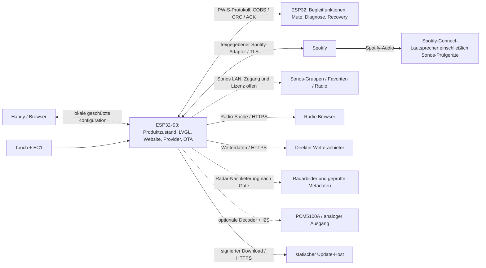

# Gesamtkonzept

Stand 2026-09-30. Verbindlicher Nutzerwunsch: Produkt für weitere Nutzer, Spotify auf Connect-Lautsprechern, Konfiguration im RotaryKnob, optional Klinke, Radio-Liste, OTA sowie inzwischen ausdrücklich Wetter/Vorhersage, Radar und Wetter-Avatar; keine HA-/MA-Abhängigkeit. Dieses Dokument beschreibt den Zielzustand. Implementiert sind bisher nur Verträge, Referenzmodelle und Webentwurf.

Die [neun beantworteten Produktfragen](15-OFFENE-PRODUKTENTSCHEIDUNGEN.md) konkretisieren diesen Auftrag: kein eigener externer Anmeldedienst, Konfiguration jederzeit im Heim-WLAN, überwiegend USB-Betrieb und gebührenfreie Wetter-/Radardaten für Deutschland. Zwei RotaryKnobs bilden den ersten Pilot; Sonos Roam und Move stehen als Connect-Prüfgeräte zur Verfügung. Die erste Produktversion enthält Spotify, Wetter/Avatar, Radioverwaltung, Website und OTA. Radar folgt danach; Radioausgabe bleibt eine spätere Erweiterung. Exakte Hardwaregenerationen, Erweiterungsmenge und Termin sind noch offen.

## 1. Produkt und Grenzen

Ein vorkonfiguriertes Gerät wird mit Strom versorgt, mit dem WLAN und einem Spotify-Konto verbunden, einem Lautsprecher zugeordnet und mit wenigen Favoriten bestückt. Danach reichen Drehen und Touch zur alltäglichen Bedienung. Telefon/Computer ist nach erfolgreicher Einrichtung für den Regelbetrieb nicht erforderlich; Spotify und der Connect-Lautsprecher brauchen Internet. Werkzeuge, YAML, persönliche Entwicklerkonten und Token-Kopieren sind kein vorgesehener Kundenweg.

| Funktion | Ziel | Bedingung |
| --- | --- | --- |
| Spotify auf vorhandenem Connect-Lautsprecher | Kernfunktion | Produktgenehmigung und geeigneter offizieller Controller-Zugang müssen zuerst belegt werden |
| Wetter, Vorhersage, Wetterfotos und Avatar | Erste Produktversion, Deutschland | Geeigneter direkter S3-Wetterprovider ohne laufende Anbietergebühren, Standort und Assetbudget; [Wetterarchitektur](14-WETTER.md) |
| Radar mit drei Zoomstufen, Regenmetadaten | Verbindlicher Folgeumfang nach erster Version | Bild-/Kartenrechte, gebührenfreie Quelle, Direktverarbeitung und ETA-/Vektordaten separat nachweisen |
| Sonos-Lautsprecher | Roam/Move als erste Connect-Prüfziele | Generationen/Steuerbarkeit prüfen; direkte lokale Sonos-Integration unter eigenem Gate, siehe [Sonos](12-SONOS-PRUEFUNG.md) |
| Play/Pause, Titelwechsel, Lautstärke, Fortschritt, Cover | Kernfunktion | Capability des Zielgeräts und zugelassener Schnittstelle |
| Freigegebene Playlists und Podcasts | Kernfunktion | Verlinken/aus Spotify übernehmen; keine eigene Spotify-Suche ohne passende Freigabe |
| Lokale Konfigurationswebsite | Kernfunktion, jederzeit im Heim-WLAN | Alle Einstellungen und Favoriten auf dem Gerät; sicherer Browsertransport unter G2 nachzuweisen |
| Zwei-Prozessor-OTA über Website | Kernfunktion | Signierte Images, Speicher- und Rollback-Nachweis |
| Radio-Liste aus Radio Browser oder eigener URL | Erste Version: Senderverwaltung | Wiedergabe erst später mit geeignetem Ausgabepfad und Produktfreigabe; blockiert die erste Version nicht |
| Radio über normalen Spotify-Connect-Endpunkt | Nicht als Fähigkeit zugesagt | Connect akzeptiert keine beliebigen Internetradio-URLs |
| Kopfhörer am Onboard-Anschluss | Optionaler Versuch | Pin-/Boardrevision, Ausgangslast und gegebenenfalls Verstärker prüfen |
| Spotify-Audio direkt am Gerät | Eigenes optionales Teilprojekt | Lizenzierter Embedded-Player, SDK-Port, Ressourcen, Zertifizierung; Web API liefert kein Audio |

Es gibt eine Favoritenfreigabe **innerhalb der RotaryKnob-Oberfläche**. Sie sperrt nicht das Spotify-Konto oder die originale Spotify-App und ist keine verbindliche Kindersicherung. Kontoübergreifende Rechte, explizite Inhalte und Marktbeschränkungen bleiben bei Spotify.

## 2. Architekturentscheidung

Der ESP32-S3 mit 16 MB Flash und 8 MB PSRAM wird Produktcontroller und Webhost. Der classic ESP32 hat nach aktueller Konfiguration 4 MB Flash ohne PSRAM und bleibt Begleitprozessor. Die bisherige Netzwerk-Bridge muss daher nicht sämtliche TLS-, JSON- und Weblast übernehmen. Ein früher Belastungstest muss zeigen, dass UI und Netzwerk auf dem S3 gleichzeitig ihre Budgets einhalten. SDK-Unterstützung ist dadurch nicht automatisch gegeben.

Die Verbindung Spotify → Lautsprecher ist der Audioweg. Der Controller leitet diese Audiodaten nicht weiter. Ein zusätzliches DAC-Audioprojekt nutzt eine eigene Pipeline. Kein ESP32-Web-Playback-SDK, kein Audio-Download über Web API, keine inoffizielle Connect-Emulation als Produktgrundlage.

### Verantwortlichkeiten

| Modul | Verantwortung | Daten / Ereignisse |
| --- | --- | --- |
| `product_core` | Einziger serialisierter fachlicher Zustand, Konfigurationsrevision, Fehlerzustände | `DeviceState`, `ConfigRevision`, Befehls-ID und Generation |
| `input_ui` | EC1-Pulserkennung, Touch, sofortige visuelle Rückmeldung, UI-Zustand | kleine gebundene Befehle, keine Netzaufrufe im UI-Thread |
| `spotify_provider` | Zugelassene Spotify-Identität und Fähigkeiten, Status und Aktionen | abstraktes `MediaProvider`; Produktadapter erst nach Gate G0 |
| `output_router` / `sonos_provider` | Geplante einzelne Steuerautorität und gesonderte Sonos-Route nach Nachweis | Haushalts-/Playeranker, dynamische Gruppen, getrennte Favoriten-/Radiofähigkeiten; [Prüfung](12-SONOS-PRUEFUNG.md) |
| `catalog` | Freigegebene Favoriten, Reihenfolge, Paginierung, lokale Bezeichnungen | Playlists, Shows, Episoden, Radioeinträge |
| `web_admin` | Lokale statische Assets, Konfigurations-API, Sitzungen, Job-Fortschritt | Keine Tokens/Passwörter über GET oder Export |
| `credentials` | Geräteschlüssel und Provider-Credentials | verschlüsselter nicht exportierbarer Speicher |
| `network` | Ein WLAN-Client auf S3, Setup-AP, Zeit, DNS, mDNS, TLS | `offline`, `connecting`, `online`, `captive_network` |
| `assets` | Begrenzte Cover-/Wetter-/Avatar-/Radardekodierung mit gemeinsamer Priorisierung | generationstreuer Cache, signierte lokale Assets, begrenzte PSRAM-Puffer |
| `weather_provider` / `weather_model` | Direkte Wetterabfrage, Standort, Einheiten, UTC-/Tagesaggregation und Frische | Normalisierte Werte, Feldgültigkeit, eigener Provider-/Quellenstatus |
| `radar_provider` / `avatar_context` | Geprüfte Radarbilder/-metadaten bzw. lokale Outfit-/Morgenregeln | Keine künstliche ETA, keine ungeprüfte Übertragung fremder Intervallsemantik |
| `uart_peer` | Versionen, Peer-Gesundheit, Mute, Updatechunks | gebundene Frames, Prioritäten, Resume, keine beliebigen Kommandos |
| `ota_manager` | Eine Transaktion für beide Chips | Journal, Vorprüfung, Signatur, Healthcheck, Recovery |
| `radio_provider` | Datenbanksuche und URL-Verwaltung; optional Radio-Audio | capability-geprüfter Ausgabepfad |

## 3. Firmwarebasis und Wiederverwendung

Zielplattform ist ESP-IDF mit getrennten Anwendungen für S3 und ESP32 und einem gemeinsam getesteten Protokollkern. ESPHome ist keine notwendige Laufzeitabhängigkeit; der bisherige ESPHome-Quellcode dient als nachweisbare Portierungsquelle. Die Übernahme von LVGL-UI und Displayinitialisierung ist ein echtes Arbeitspaket, kein unveränderter Headerimport. Toolchain, LVGL-Major und Displaytreiber werden erst nach Build-/Speicher-Spike gemeinsam fixiert; keine fiktive aktuelle Versionsnummer.

Übernommen werden Bedienverhalten, Display-/Touchparameter, Pulszählung, Haptik, Priorisierung, atomare Medienanzeige, Paginierung und bewährte Fehlerfälle. Entfernt werden HA-Entitäten, Native API, Music-Assistant-Aufrufe, Haus-/Lichtfunktionen und fremde Kundeneinstellungen. Wetter wird ausdrücklich portiert: Darstellung/Avatar lokal, Datenabruf und Radaraufbereitung über neue direkte S3-Adapter. Timer/Wecker, Fotoalbum und übrige Smarthome-Seiten bleiben außerhalb dieser Edition; Uhr und Standby bleiben lokal. [Featuretabellen](13-FEATURE-PORTIERUNG.md) unterscheiden vorhandenes Verhalten, notwendige Anpassungen und neue Funktionen.

### Bedienung

- Startansicht: Titel, Interpret oder Podcast, Fortschritt, Lautsprecher und Lautstärke.
- Drehen: Lautstärke; im geöffneten Favoriten-/Gerätemenü bewegen.
- Touch: Play/Pause, vorheriger/nächster Titel oder Episode, Favoriten, Lautsprecher, Einstellungen.
- Keinen Ring-Druckschalter voraussetzen: Im auditierbaren Profil ist kein solcher Eingabepfad belegt.
- Fehlende Fähigkeiten deaktivieren die zugehörigen Aktionen mit Erklärung; niemals still auf ein anderes Zimmer wechseln.
- Bei Geräteverlust: Auswahl behalten, als nicht erreichbar anzeigen, erneute Auswahl oder kurze Anleitung zum Aktivieren in Spotify.
- Lautstärke optimistisch darstellen; autoritative Bestätigung übernimmt den tatsächlichen Wert. Obergrenze begrenzt Knob-Kommandos, nicht andere Spotify-Clients.
- Sichtbare Spotify-Zuordnung und erlaubte Metadaten-/Coverdarstellung nach freigegebenen Designregeln; Cover nicht beliebig zuschneiden wie bisherige Vollbild-Überscan-Lösung.

## 4. Daten, Parallelität und Ressourcen

Ein Actor/Eventloop besitzt den Produktzustand; Web- und Drehbefehle laufen durch dieselbe Warteschlange. Lautstärkebefehle werden mit 150–250 ms Startwert zusammengefasst (messbar abstimmen), absolute Werte bevorzugt. Next/Previous werden nach Timeout nicht blind wiederholt. Nur ein Provider-Aufruf pro Steuersequenz; neuere Auswahl supersediert alte, ohne deren verspätete Antworten zu übernehmen. Playback wird nach Provider-Bestätigung als tatsächlich gestartet dargestellt, nicht bereits nach HTTP-Akzeptanz.

Metadaten bilden atomare Snapshots mit Sitzung + monotoner Generation + Track-/Episode-ID. Cover gehört zu genau dieser Generation. Ersetzte Downloads werden verworfen. Fortschritt wird aus einem bestätigten Zeitstempel lokal interpoliert; API-Polling ist adaptiv, z.B. aktiv 3–5 s, ruhig 15–30 s, Hintergrund 60 s als zu messende Anfangswerte. Nach eigenen Aktionen begrenzte unmittelbare Statusabfrage. Keine offizielle Push-Verbindung erfinden. SDK-Ereignisse können Polling ersetzen, wenn freigegeben.

Vorgeschlagene Startlimits: 64 Spotify-Favoriten, 64 Radioeinträge, 20 Zeilen pro Geräteansicht, maximal 256 KiB komprimiertes Cover, höchstens drei HTTP-Weiterleitungen, Downloadzeit/Größe/MIME und Bildabmessungen begrenzen. Die eigentliche Spotify-Pagination folgt dem genehmigten API-Profil (Development ggf. 10 Suchergebnisse), nicht einem universellen Limit. Spätere Grenzwerterhöhungen benötigen Heap-/Latenznachweis.

Webassets ohne CDN, Frameworklaufzeit, Tracker oder externe Schriftdateien, vorab gzip-komprimiert. Zielbudget höchstens 256 KiB komprimiert. Zwei gleichzeitige TLS-Verbindungen als Anfangsobergrenze, kleine Streamingparser statt vollständiger Bibliothekskopien. DMA-Puffer in internem RAM, Bilder/Kataloge in PSRAM. Belegungsgrenzen sind Gate G1; Espressif/Spotify können Anforderungen ändern.

## 5. Produktbetrieb und Wartung

Hersteller flasht beide Chips und hinterlegt eine gemeinsame Produktidentität sowie individuelle Gerätezugänge. Kunden richten ein fertiges, unkonfiguriertes Gerät ein. USB-Erstflash beider Chips ist ein Werkstatt-/Recovery-Verfahren; die bekannte USB-C-Orientierung wird dokumentiert, nicht dem normalen Onboarding zugemutet.

Im überwiegend per USB versorgten Normalbetrieb läuft nur S3-WLAN; Website und Steuerung bleiben auch bei ausgeschaltetem Display erreichbar. Änderungen der Konfiguration müssen sicher im Heim-WLAN möglich sein, ohne Wechsel ins Geräte-WLAN. Der sichere Browserweg einschließlich Identität und gegebenenfalls Zertifikatserneuerung bleibt Gate G2. Wiederherstellung ist auch ohne Spotify, Internet oder gültiges Benutzerkonto möglich. Ein verlorener WLAN-Zugang öffnet nicht unbegrenzt automatisch einen ungesicherten AP; Setup/Recovery werden physisch und zeitbegrenzt ausgelöst. Eigentümerwechsel löscht WLAN, Spotify-Credentials, Sitzungen und Favoriten; Firmwareversion/Herstelleridentität können bleiben.

Ein statischer Updatehost bleibt als Distributionsinfrastruktur erlaubt. Ein eigener externer Spotify-Anmeldedienst ist abgelehnt; auch eine eigene extern gehostete Callbackseite wird nicht als Ersatz eingeführt. P1/P4 prüfen einen genehmigten Partner-/Geräteflow unter dieser Vorgabe. Erfordert der tatsächlich verfügbare Spotify-Weg einen eigenen externen Dienst, bleibt das Produktgate offen und der Befund wird zur Entscheidung vorgelegt. Eine verpflichtende zusätzliche App ist ebenfalls nicht beschlossen.

## 6. Maßstab für den ersten nutzbaren Stand

Ein erster technischer Funktionsnachweis umfasst ein zugelassenes Spotify-Konto, einen Connect-Lautsprecher und wenige Favoriten, stabile Titel-/Coverwechsel, Neuverbindung nach Stromausfall, sichere Heimnetz-Konfiguration und ein überstandenes unterbrochenes Update beider Chips. Darauf folgt L3 mit zwei RotaryKnobs des vorhandenen Hauptprojekttyps, Sonos Roam/Move, Wetter/Avatar und Radioverwaltung. Beide Sonos-Generationen und tatsächliche Knob-Revisionen sind zu erfassen; Geräteverfügbarkeit ist kein Kompatibilitätsbeweis.

L4 als erste Produktversion verlangt erweiterte Nutzer-/Modellabnahme, Plattform-Onboarding und die Gates für ihren Umfang im [Implementierungsplan](08-IMPLEMENTIERUNGSPLAN.md). Zwei Pilotgeräte legen weder die Zahl der Testpersonen noch die spätere Produktionsmenge fest. Radar wird in L5 separat qualifiziert und nachgeliefert; sein offener Status blockiert L3/L4 nicht. Weitere Lautsprecherhersteller sind erst nach entsprechender Prüfung als kompatibel auszuweisen.

Normaler Standby schaltet das Display ab und nutzt abgestimmten Modem Sleep. Der S3 muss für Website und Provider erreichbar bleiben; sein bisheriges Deep Sleep wäre jetzt ein ausdrücklich offline gehender Betriebsmodus.

## 7. Sonos-Erweiterung

[Die Sonos-Architektur](12-SONOS-PRUEFUNG.md) unterscheidet Connect, offizielle LAN-Steuerung und Cloud. Aktiv geplant sind Roam/Move als Spotify-Connect-Prüfziele und die gesonderte Untersuchung der offiziellen LAN-Integration. Letztere hat noch keine zugesagte Vertriebs-/API-Freigabe. Sonos Cloud mit eigenem Authentifizierungsdienst ist unter den bestätigten Vorgaben keine aktive Umsetzungsroute; die dokumentierte Variante begründet keine Einführung eines solchen Dienstes.

## 8. Wetter als integrierter Funktionsbereich

[Wetter, Radar und Avatar](14-WETTER.md) teilen sich Zeit, Konfiguration, Assets und UI-Scheduler mit Medien, haben aber eigene Provider-/Standortgenerationen. Der S3 fragt für Deutschland geeignete Wetterdienste ohne laufende Anbietergebühren direkt ab; keine lokale Wettervorhersageberechnung und kein eigener HA-/Rendererserver. DWD ist der erste Prüfkandidat, MET Norway gegebenenfalls eine Alternative nach Quellen-/Betriebsnachweis. Bezahlte Open-Meteo-Customer-Tarife sind keine aktive Option. Standort/Provider/Morgenavatar sind über die Website konfigurierbar. Wetter/Avatar gehören zur ersten Version; drei Radar-Standbildzooms folgen in L5. ETA/Richtung brauchen gesonderte gültige Metadaten.

Wetterabruf und Decoder werden Medienbefehlen nachgeordnet, bei OTA ausgesetzt und begrenzt gecacht. Die 15 Wetterfotos werden komprimiert statt als rund 4 MB Rohbilder eingeplant. Signierte Firmware und Assets müssen gemeinsam rückrollbar bleiben. Die letzte gesicherte Quelle darf als veraltet angezeigt, niemals durch erfundene Werte ersetzt werden. Die Wettererweiterung ist geplant; aktuelle Verträge und Webdemo sind dafür noch zu erweitern.
