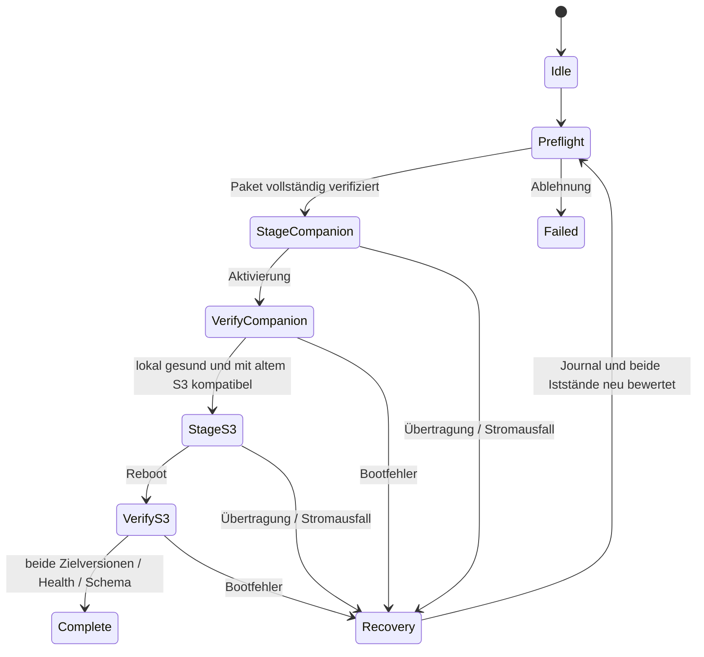

# OTA, Sicherheit und Wiederherstellung

Ziel: Ein Updateknopf für ein Gerät mit zwei Chips. Der Koordinator ist S3, der Begleitprozessor classic ESP32. Kein HA-Updater. Die gelieferten Referenzmodelle simulieren nur Reihenfolge und Ablehnungsregeln; sie implementieren weder Kryptografie noch Flashzugriffe.

## 1. Release- und Paketvertrag

Eine Produktversion, zwei rollenspezifische Images. Manifest: Produkt-/Hardwarefamilie und Revisionen, Release-ID, Kanal, Version, Formatversion, Konfigurationsschema, kompatible Protokollbereiche, Sicherheitsversion, Mindestbootloader, Imagegrößen, SHA-256, Downloadpfade und Signaturschlüssel-ID. Images selbst sind vom Gerät verifizierbar signiert. Manifest-Signatur bindet alle Felder und beide Rollen.

Manifest-Signatur über exakt definierte Bytes (beispielsweise kanonisches JSON nach festgeschriebener Implementierung) und Detached-Signaturformat. Algorithmus/ESP-IDF-Verifikation nach tatsächlicher Chiprevision und Bootloaderpfad festlegen; kein handgeschriebenes Kryptosystem. Public Keys mit verifiziertem Boot-/Firmwareimage vertrauen; private Schlüssel offline oder in kontrolliertem CI-Signingdienst, niemals im Repo/Gerät. Rotation mit Überlappung, Widerruf und Recovery planen. TLS schützt Transport, Hash gegen Beschädigung, Signatur gegen nicht autorisierte Herausgeber; CRC ist nur UART-Fehlererkennung.

`examples/update-manifest.example.json` ist absichtlich **nicht installierbar**: `example_only=true`, Beispieldomain, Dummyhashes, keine echte Signatur. Das Gate lehnt es ab. Es darf nicht als Updateangebot veröffentlicht werden.

Versionierter statischer HTTPS-Host mit unveränderlichen Releasepfaden genügt für Downloads; keine Cloud-Steuerung. Kanalzeiger erst verschieben, wenn Manifest, beide Images, Signaturen und Herkunftsbeleg vollständig abrufbar/verifiziert sind. Der neue Produktname verhindert zufällige Installation eines HA-Images.

## 2. Speicher und Trust Bootstrapping

Beide Chips brauchen zwei ausreichend große OTA-Appslots, `otadata`, verschlüsselte Credentials/Konfiguration bzw. Peerzustand und genügend Journalplatz. S3-Webassets möglichst ins signierte Appimage einbetten, damit Website und Backend gemeinsam zurückrollen. Keine Speicheradressen als geprüft ausgeben: reales Flashlayout, Bootloader, Imagegröße plus Reserve und Anforderungen des genehmigten SDK sind Gate G1. Beim classic ESP32 können 4 MB zum Engpass werden; schlanke Begleitfirmware planen.

ESP-IDF unterstützt OTA-Rollback mit zunächst unbestätigtem Image; Signaturprüfung lässt sich unabhängig von bereits aktivierten Secure-Boot-eFuses einplanen. ESP32-Chiprevision und S3 unterstützen nicht automatisch dieselben Hardware-Sicherheitsoptionen. Hardware-Secure-Boot, Flash-/NVS-Verschlüsselung und eFuse-Provisionierung sind Fertigungsentscheidungen mit eigener Recoveryprobe, keine nebenbei ausgeführte Entwicklungsaktion. [ESP-IDF OTA](https://docs.espressif.com/projects/esp-idf/en/stable/esp32s3/api-reference/system/ota.html), [HTTPS OTA](https://docs.espressif.com/projects/esp-idf/en/stable/esp32s3/api-reference/system/esp_https_ota.html), [NVS Encryption](https://docs.espressif.com/projects/esp-idf/en/stable/esp32s3/api-reference/storage/nvs_encryption.html)

## 3. Website und Backend

| Oberfläche | Geplante Backendaktion |
| --- | --- |
| Nach Updates suchen | signiertes Kanalmanifest laden/prüfen; kein Flashen |
| Details / Releasehinweise | Versionen, Größen, Ziele, kompatible Geräte, Auswirkungen anzeigen |
| Paket hochladen | signiertes Bundle begrenzt annehmen und dieselbe Prüfung wie Download durchführen |
| Jetzt installieren | autorisierte Sitzung + Vorprüfung + neue Transaktions-ID; genau eine Transaktion |
| Fortschritt | nach Neuladen erneut abrufbarer Zustand pro Phase/Chip; Polling, später optional SSE |
| Abbrechen | nur vor unumkehrbarer Aktivierung bzw. an dokumentiert sicheren Stagingpunkten |
| Wiederholen / Wiederherstellen | Journal lesen, sichere passende Phase fortsetzen; nicht pauschal bei null beginnen |

Keine freie ungeprüfte Firmware-URL, kein einzelnes unsigniertes BIN für normale Kunden. Lokaler Upload und Download haben identische Rollen-/Signatur-/Größenregeln. Anti-CSRF, Origin-/Host-Prüfung, authentifizierter Administrator und erforderlichenfalls physische Bestätigung. Während Update: Audio stumm/beendet, schwere Coverjobs aussetzen; Eingaben in UI und Statusseite weiterhin beantworten soweit Flashoperationen erlauben. Netzteil verlangen oder nachgewiesene Energiereserve; vorhandener Akkuspannungswert ist kein präziser Fuel Gauge.

## 4. Ablauf über beide Prozessoren

1. **Preflight:** echte Hardware-ID und Flashgrößen, Images/Signaturen, beide Zwischenkombinationen, Bootloader/Sicherheitsversion, Settingsmigration, Stromversorgung, Peer-Erreichbarkeit. Vollständiges Paket prüfen, bevor ein Bootslot gewechselt wird. S3-Stagingplatz/Streamingverfahren muss dies ermöglichen.
2. **Journal vorbereiten:** Transaktions-ID, aktuelle und Zielversion, Manifesthash, Rollen, gültige alte Slots, bestätigte Phasen. Atomar mit CRC/Generation und Rückwärtskompatibilität persistieren, keine Secrets.
3. **ESP32 companion stagen:** inaktiver Slot über neuen binären UART-Updatekanal; Offset, Paketlänge, Sequenz, ACK, Fehlerzähler und Resume. ESP32 prüft selbst komplette Signatur, Rolle, Hardware, Größe, Version. Nur Host-Hash genügt nicht.
4. **ESP32 aktivieren/prüfen:** reboot, Bootreport, eigener kurzer Selbsttest und kompatibler UART-Handshake mit altem S3. Danach lokalen Slot bestätigen; Produkttransaktion bleibt offen.
5. **S3 stagen/aktivieren:** inaktiver Appslot, eigene Verifikation, persistierter Phasenübergang vor Reboot; nach Start UI/Storage/Web/UART-Gesundheit prüfen. Spotify/Internet dürfen die lokale Bootbestätigung nicht verhindern.
6. **Produkt bestätigen:** beide Zielversionen und kompatible Peers, Settingsschema und lokale Selbsttests erfolgreich. Erst dann `complete`. Altes Paar und Settingssnapshot bis Ende des definierten Rückfallfensters erhalten.

Die lokale Bootbestätigung eines Chips ist nicht die Abschlussbestätigung des Produktupdates. Nach Bestätigung des ESP32 muss sein altes signiertes Image weiterhin für einen koordinierten Rückfall verfügbar bleiben; IDF-Boot-Rollback allein löst nicht jede Zweichip-Recovery.

Kein Versprechen eines atomaren Flashwechsels zweier Chips. Temporäre Versionsmischungen sind erwartbar und müssen durch explizite N/N+1-Verträge funktionieren. Wire-Version allein reicht nicht: Commands, Bootreports und Journals müssen die Paarungen tatsächlich unterstützen. Update verlangt Nachweise für **altes S3 + neues ESP32** und **neues S3 + neues ESP32**, plus Rückfallpfad.

## 5. Fehler und Recovery

| Störung | Erwartung |
| --- | --- |
| Browser geschlossen | Gerätejob läuft weiter; später Status lesen |
| Download/UART abgebrochen | bisher aktives Image bleibt, bestätigten Offset/Hash prüfen, Resume oder sauber neu stagen |
| ESP32 startet nicht gesund | eigener A/B-Rückfall; S3 meldet Recovery, S3-Update unterbleibt |
| S3 startet nicht gesund | eigener A/B-Rückfall; alter S3 muss neuen ESP32 verstehen und Journal fortsetzen/rollbacken |
| Stromausfall an beliebigem Schritt | Boot-/Journalzustände beider Chips rekonstruieren; niemals aus Prozentwerten Erfolg ableiten |
| Settingsmigration fehlerhaft | alter Schema-Snapshot wiederherstellbar, Secrets nicht vernichten |
| Peer komplett unansprechbar | USB-Recovery anbieten; keine unbelegte fernsteuerbare EN/BOOT-Leitung voraussetzen |
| Signatur, Rolle, Board oder Größe falsch | vor Aktivierung ablehnen, genaues nicht sensibles Fehlerlabel |

Keine automatische Rückstufung unter freigegebene Sicherheitsversion. Fehler-Rollback und Anti-Rollback sind verschiedene Mechanismen; Hardware-Sicherheitszähler erst erhöhen, wenn die Rückfallpolitik dies erlaubt und die Kandidaten beider Chips qualifiziert sind. Falsche irreversible eFuse-Schritte können den Rettungsweg schließen.

## 6. Sicherheitsmodell

- Schutzgüter: WLAN-/Providerzugang, Geräteschlüssel, Kontozuordnung, Favoriten, zulässige Firmware.
- Grenzen: Browser↔S3, S3↔Internet, S3↔ESP32, persistenter Speicher, Signier-/Fertigungsprozess.
- Keine Zugangsdaten in APIs/Exporten/Crashlogs; redigierte Diagnose, kleine Ringpuffer, kein Telemetriezwang.
- UART besitzt Framing/CRC; neue Updateframes verlangen Signaturen und rollenbezogene Prüfung. Physischer Buszugriff ist kein genehmigter Updateautor.
- Session-Rotation, Zeitlimits, Reauth für Eigentümerwechsel; Bootzeit ohne sichere Uhr darf keine TLS-Zertifikatsprüfung aushebeln.
- Schlüsselverlust/Revoke, fehlerhafte Uhr, abgelaufene Zertifikate und Rückkehr vom Updatehostausfall gehören in den Testplan.

Die bestehende PassionWave-Releasepraxis liefert Paarversions-, Herkunfts- und Prüfideen; HA-/HACS-Promotion wird nicht in das neue Produkt übernommen. Ein eigenständiger Releasejob baut beide Rollen deterministisch, prüft sie, signiert, erzeugt Herkunftsbeleg und veröffentlicht erst nach Geräteabnahme.

## 7. Wetter-/Avatarassets im Update

Der erweiterte Port übernimmt lokale Wetterfotos und Avatar-JPEGs. Bevorzugt liegen komprimierte Assets im signierten S3-Appimage, damit A/B-Rollback Website, Wetterdarstellung und Code gemeinsam zurücksetzt. P2 muss dafür beide vollständigen Appslots plus Reserve und Staging nachweisen. Die alte RGB565-Einbettung wird nicht unverändert übernommen.

Falls die Größenrechnung separate Assets verlangt, sind Paketversion, Hash/Signatur, Kompatibilität, vollständiges Staging und Rückfall des alten Assetbestands zusätzlich verbindlich. Kein Überschreiben der einzigen aktiven Assetpartition während eines Updates. Das heutige Zwei-Image-Manifest enthält noch keinen solchen Zusatzvertrag; erforderliche Erweiterung gemeinsam mit Schema/Verifier/Tests versionieren. Wetter-/Radarnetzwerk und große Decodejobs ruhen während OTA. Bootgesundheit bleibt von Wetter-/Spotifyinternet unabhängig.
