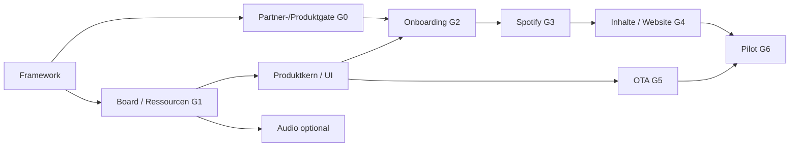

# Schrittweiser Implementierungsplan

Ziel ist ein eigenständiges Produkt für weitere Nutzer. Die Reihenfolge verhindert, dass umfangreiche UI-/Firmwarearbeit einen ungeklärten Spotify-Produktzugang verdeckt. Status aller Hardware-/Live-Gates: **offen**. Das Repository ist die abgeschlossene Planungs-/Frameworkphase P0, kein abgeschlossener Produktbau.

Schätzungen sind aktive Entwicklungszeit für eine erfahrene Person mit Testhardware; keine Termine. Spotify-Verträge, SDK-Zugang, Zertifizierung und Bauteillieferzeiten sind unbestimmt und nicht darin enthalten. Nach jedem Spike neu schätzen. Ein realistischer erster integrierter Pilot liegt grob bei 10–18 Entwicklungswochen, abhängig von wiederverwendbarem Code und genehmigter Schnittstelle; optionales Audio zusätzlich. Mehrere Arbeitspakete können parallel laufen.

## P0 — Framework und Entscheidungsgrundlage (in diesem Repository)

- Erledigt: Bestandsanalyse, Primärquellen, unabhängige Repositorystruktur, Produkt-/Providergrenzen, Konfigurations-/OTA-Verträge, C++-Schnittstellen, interaktiver Webentwurf, prüfbare Referenzmodelle, Implementierungs-/Abnahmeplan.
- Nicht erledigt: Gerätefirmware, echte Web-API, Spotify-Login, Radio-Onlineabfrage, Audio oder Hardware-OTA.
- Ausgang: Dokumente und Tests konsistent; Nutzer kann Umfang und Hürden konkret prüfen.

## P1 — Produktzugang und Machbarkeit (Gate G0; externe Dauer offen)

1. Produktblatt aus docs01/02 erstellen: Fremdlautsprecher-Controller, lokale Website, Playlists/Podcasts, optional Radio/Klinke.
2. Organisation/Vertriebsszenario und gewünschte Stückzahl klären; Partneranfrage durch verantwortlichen Eigentümer absenden, keine eigenmächtige Kommunikation aus diesem Framework.
3. Spotify/ggf. Espressif/Systems Integrator um genaues zugelassenes Profil und Plattformpaket bitten.
4. Vor Entwicklervertrag technische Anforderungen und SDK-Nutzung/Redistribution dokumentieren; proprietäre Dateien getrennt halten.
5. Entscheidung festhalten: zugelassener Controller auf dieser Hardware / hardwareändernder Empfängerpfad / keine passende Freigabe.

**Abnahme:** belegte Zulässigkeit und tatsächlich bereitgestellte Schnittstelle für mehrere Kunden und fremde Connect-Lautsprecher. Ein erfolgreicher persönlicher API-Aufruf reicht nicht. Bei offenem G0 laufen P2/P3/P5-Basis/OTA weiter, Produkt-Spotify und Vermarktung bleiben gesperrt.

## P2 — Board, Betriebssystem und Ressourcen (3–5 Tage; G1)

1. Je ein testbares Gerät plus USB-Recovery bereitlegen, beide MCU-/Flashrevisionen erfassen.
2. Gepinnte Upstream-Revision prüfen und Quellübernahmeliste mit Lizenzhinweisen erstellen.
3. ESP-IDF/LVGL/Treiber-Versionen fixieren, getrennte minimale Builds für S3 und ESP32 herstellen.
4. S3: Display, Touch, zwei EC1-PCNT-Pulsleitungen, Haptik; ESP32: UART und EC2-Diagnose, keine doppelte Eingabe.
5. Partitionen für A/B, Journal, Einstellungen, embedded Webassets berechnen, reale Binarygrößen messen.
6. Gleichzeitige UI + TLS + JSON + Webserver + Coverprobe; internen RAM/PSRAM/DMA, Watchdog und maximale Latenz protokollieren.
7. Standbystrategie: Display aus/Modem Sleep bei erreichbarem Backend; Deep Sleep nur ausdrücklich offline.

**Abnahme:** wiederholbarer Build mit Lockfiles/Hashes, reale Flashmap, ausreichende Reserve (Startziel ≥20% je Appslot nach maximalem Featurebuild), keine UI-Blockade. Wenn zugelassenes SDK nicht auf S3 passt: vor Weiterarbeit Hardwareentscheid, nicht automatisch Cloud auslagern.

## P3 — Lokaler Produktkern und Portierung (8–12 Tage)

1. `product_core`, Eventqueue, monotone Generationen, Konfigurationsrevision und Journal installieren.
2. EC1-Portierung mit Drehrichtung/Filter/Überlauf; `input_ui` unabhängig von Netzverkehr.
3. Medienansicht und Favoritenpicker aus bestehendem LVGL-Verhalten portieren; HA-/MA-/Wetter-/Lichtansichten ausbauen.
4. Spotify-konforme Cover-/Markendarstellung festlegen; freigegebene Assets einbinden.
5. Neues PW-S-Protokoll mit Produktkennung, Rollen und Capability-Handshake; HA-Firmware wird abgelehnt.
6. Atomare Konfigurationsspeicherung, Schema-Migration, Default/Wiederherstellung, Secrets-Abgrenzung.

**Abnahme:** Mock-Bedienung auf echtem Display, schnelle Drehung, parallele Eingaben, stale Snapshots und kaputte UART-Frames beherrscht. Vorhandenes UI-Verhalten ist portiert, kein Fake-Netzwerkstatus.

## P4 — WLAN, Verwaltung und Konto-Verknüpfung (7–12 Tage; G2)

1. Fertigungsidentität und individuelle QR-/AP-Zugänge erzeugen, keine gemeinsamen Secrets.
2. SoftAP-Wizard, 2,4-GHz-Scan/manuelle SSID, AP+STA, Verbindungstest und persistente Wiederaufnahme implementieren.
3. Geschützte Sitzung, Origin/CSRF-/Host-Prüfung, Zeit-/Ratebegrenzung, physische Bestätigung.
4. Dauerhaften LAN-Verwaltungsweg (vertrauenswürdiges HTTPS) gegen sicheren AP-Kompromiss prüfen; Entscheidung dokumentieren.
5. Zugelassenen `AccountLinker` implementieren. Falls G0 Web-API zulässt: PKCE-Verifier auf S3, HTTPS-Callbacklösung explizit entscheiden; kein heimlicher externer Dienst.
6. Tokenrotation, Widerruf/Trennen, Reconnect und Eigentümerwechsel testen.

**Abnahme:** iOS/Safari und Android/Chrome sowie Desktop, captive mini-browser Exit, Handywechsel ins Heimnetz, Kennwortfehler, Authabbruch und mehrere Geräte. Mindestens fünf unbeteiligte Erstnutzer in Prototyptest, später zehn im Pilot. Keine Entwicklerkonsole für Kunden.

## P5 — Spotify-Controller und Gerätefähigkeit (7–12 Tage nach G0/G2; G3)

1. Minimaladapter zuerst: Gerätesichtbarkeit, Zustand, Play/Pause, Lautstärke; Flags und zugelassene Geräteprofile.
2. Geräteauswahl speichern, ID-Neuauflösung und doppelte Namen; keine automatische andere Ausgabe.
3. Command-Coalescing, Neueste-Auswahl-Regel, Zustandsbestätigung, Timeouts und Quotensteuerung.
4. Metadaten, Fortschritt und sequenzgebundene Cover; 204, unbekannte Medientypen, private Session/Reduktionen.
5. Mindestens zwei Lautsprecherfamilien und mehrere Konten; Standby, App-Steuerung parallel, Internetverlust.
6. Premium-/Berechtigungswechsel und Zugangserneuerung; keine Secrets in UI/Diagnose.

**Abnahme:** unabhängiger Alltag ohne Telefon/HA/MA nach Einrichtung; kontrollierte Recovery. Speaker-Matrix bezeichnet nachgewiesene Modelle, nicht „alle Connect-Geräte“.

## P6 — Inhalte und fertige Webverwaltung (6–10 Tage; G4)

1. Demo durch eingebettete Webassets + echte versionierte API ersetzen; Entwurfskennzeichnung erst nach echtem Backend entfernen.
2. Einstellungen vollständig gemäß docs03, atomare Save/Import/Export-Funktion ohne Zugangsdaten.
3. Playlist-/Show-/Episodenreferenzen validieren, erlaubter Preset-Import, aktiv/inaktiv und Reihenfolge, Größenlimits.
4. Eigene/mitbearbeitete/fremde/editorielle Playlists und fehlende Tracklisten getrennt behandeln.
5. Podcast-Sammlung, Episodenanzeige, erlaubter direkter Episodenstart, Resume und Nichtverfügbarkeit nachweisen. Fehlende Funktion nicht als „Queue+Next“ verstecken.
6. Radio-Browser-Client: Spiegelwahl, Suche, Probe, eigene URL, Feld-/Netz-/Codecvalidierung. Konfigurierbarkeit unabhängig vom späteren Audioausgang.

**Abnahme:** alle freigeschalteten Elemente konsistent auf Website und Gerät; keine entfernten Inhalte durch alte Auswahlgenerationen. Radio ohne geeigneten Ausgang erklärt gesperrt. Barrierefreiheit und mobile Breiten prüfen.

## P7 — OTA auf Hardware und Releaseprozess (8–15 Tage; G5)

1. Eigene signierte Artefaktkette, Trustanker, Manifestparser, Prüfschnittstellen und Rollback-Slots.
2. UART-Updater im ESP32 mit bounded chunks/ACK/Resume; Signaturprüfung auf dem Zielchip.
3. S3-Koordinator: Manifest/Uploadvorprüfung → ESP32 → lokale Healthbestätigung → S3 → Paarabschluss.
4. Persistentes Journal, N/N+1-Kompatibilität, Settingssnapshot und Website-/App-Gleichlauf.
5. Fortschritt/Fehler/Recovery in Website und Display; Browserabbruch tolerieren.
6. Automatisierte Fault-Injection plus reale Strom-/UART-Unterbrechung an jedem relevanten Punkt.
7. Statische immutable Releases, Pair-Builds, SBOM/Herkunft, Signierjob, getrennte stabil/beta-Zeiger; noch kein automatisches Geräteupdate nach Firmwareveröffentlichung.

**Abnahme:** Testkatalog docs09 einschließlich beschädigter Signatur, falscher Rolle, zu großer App, inkompatiblem Zwischenpaar, Bootloop und manueller USB-Recovery bestanden. Weder Prozent100 noch ein Chip auf Zielversion genügt.

## P8 — Optionaler Audiozweig (5–10 Tage Radio; Spotify-Empfänger separat)

1. Hardware-Revision und tatsächliche Klinkenschaltung; Line vs. Kopfhörer schriftlich/messbar auflösen.
2. Mute/Mux/I2S mit Testlast, leise Pegel, Rampen, Ein-/Ausschaltverhalten.
3. MP3 → AAC jeweils Codec-/Lizenz-/CPUtest; HLS zunächst nicht versprechen.
4. Wiedergaberoute, sichere Lautstärke, Unterlauf und Spotify-/Radio-Umschalten ohne gleichzeitigen Mischbetrieb.
5. Lokaler Spotify-Receiver nur mit eigenem zugelassenen SDK-/Zertifizierungsprojekt.

**Abnahme:** hörbar/elektrisch auf echter Hardware geprüft, sichere Last, kein UI-/Netzeinbruch. Wenn kein Kopfhörerverstärker: Line-Ausgang beschriften oder Hardware ergänzen. Dieser Zweig blockiert den reinen Controller nicht; Radio-Hörfunktion bleibt bis dahin eingeschränkt.

## P9 — Pilot und Produktabnahme (5–10 Tage plus Langzeittest; G6)

1. Zehn Erstnutzer durch Einrichtung und Kontowechsel begleiten; Fehlerzahl/Zeit ohne Hilfestellung messen.
2. Mindestens 72 Stunden gemischte Wiedergabe-/Standby-/Netzverlusttests, Heap-/Watchdog-/Tokenbeobachtung.
3. Mehrere Knobs/Haushalte und parallele Spotify-App-Nutzung; keine Kontovermischung.
4. Wiederholtes Update/Rollback, Factory Reset, nicht erreichbarer Updatehost, geänderter Router.
5. Support, freigegebene Gerätematrix, bekannte Grenzen, Privatsphäre-/Lizenz-/Produkttexte und Partnerzertifizierung abschließen.

**Abnahme:** unabhängige Releasefreigabe auf exakt signierten Artefakten. Keine Aussage „fertig“ aus erfolgreich kompiliertem Code allein.

## Abhängigkeiten und nächste konkrete Arbeit

Nächster Firmwareauftrag: P2-Board-/Ressourcenspitze auf einem ausdrücklich gewählten Testgerät. Parallel kann der Eigentümer P1 klären. Keine Produkt-Client-ID und keine Firmwareveröffentlichung werden in der Planungsphase angelegt.

## Zusätzlicher Sonos-Prüfzweig S (vor Adapterimplementierung)

Einordnung: [Sonos-Architektur](12-SONOS-PRUEFUNG.md). S1 kann mit P5 laufen, S2 parallel zu P1; keine zusätzliche Firmware-/Backendabhängigkeit wird vorausgesetzt.

1. **S1 Connect-Spike (1–2 Tage nach geeignetem API-Zugang):** vorhandenen Move nach Generation inventarisieren, stationäres Vergleichsgerät, Einzel-/Gruppenziel, Sichtbarkeit, Start/Volume/Metadaten, Standby und Reconnect. Gate S-CONNECT.
2. **S2 LAN-Produktzugang (externe Dauer offen):** offizielle Lizenz/Zugang, sicheres lokales Pairing, Discovery/Events, Gerätegenerationen und Content-/Radiofähigkeiten bestätigen. Gate S0-LAN.
3. **S3 Adapterentwurf (1–2 Tage nach S2):** eine Steuerautorität, Playeranker statt dauerhafter Gruppen-ID, haushaltsgebundene Sonos-Favoriten, keine geheimen Musikdienstzugänge auslesen. Schnittstellenänderung gemeinsam versionieren.
4. **S4 Inhalts-/Radio-Spike (2–4 Tage nach Zugang):** Spotify-Favorit/Podcast, Queuewirkung, vorhandene Radiofavoriten, eigene Radio-Browser-URL getrennt. Cloud-Sessionbedingungen nicht ungeprüft auf LAN übertragen. Gates S-FAVORITE, S-RAD-01/02.
5. **S5 Gruppen-/Route-/Modelltest (2–3 Tage):** Wechsel während Bedienung, doppelte Sichtbarkeit über Connect/Sonos, mehrere Haushalte, portable Geräte und optionale S1-Kompatibilität. Gates S-GROUP, S-ROUTE, S-MODEL.
6. **S6 Entscheid:** lokalen Adapter nach erfolgreicher Prüfung in P5/P6 integrieren; bei fehlendem Zugang Connect-Pfad behalten. Cloud nur mit ausdrücklich akzeptiertem sicheren Dauerbetrieb, keine geteilten Firmwaresecrets und kein stiller Serverzwang.

Diese Schätzungen betreffen die Untersuchung, nicht bereits eine vollständige Sonos-Implementierung. Alle Sonos-Gates sind offen; bestehende OTA-/Hardwareabnahmen bleiben erforderlich.
