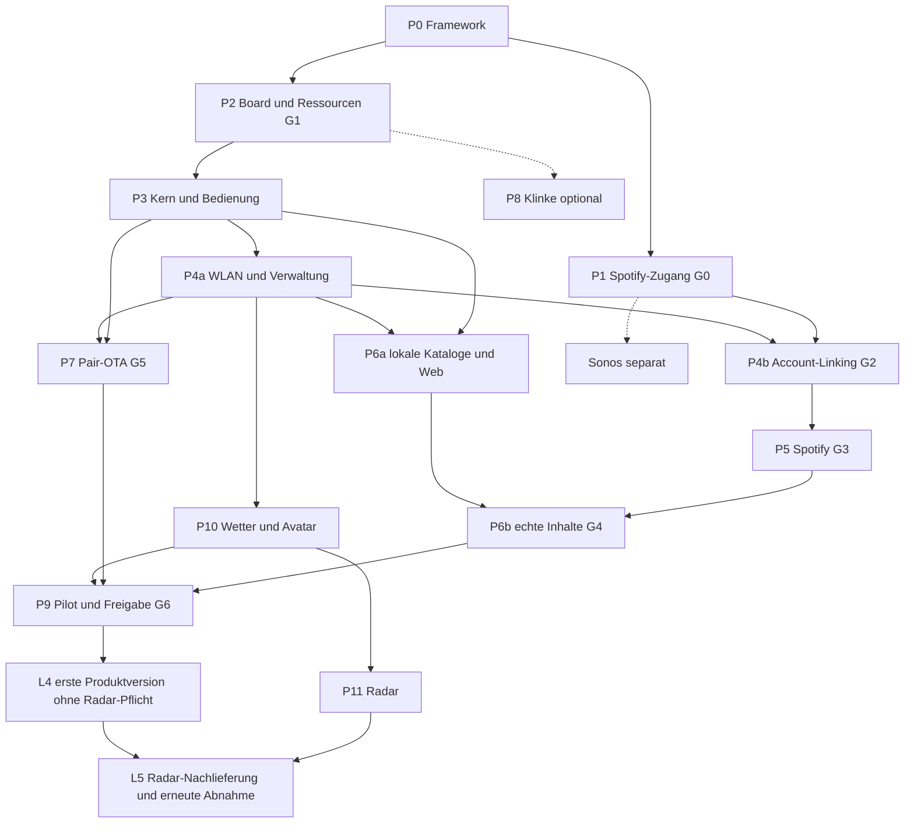

# Vollständiger Implementierungsplan: Spotify, Wetter und RotaryKnob-Portierung

Stand: 30. September 2026. Ziel: eigenständiges Gerät für weitere Nutzer mit vertrauter Medienbedienung, Spotify Connect, Wetter inklusive Avatar und Radar, geräteinterner Konfigurationswebsite, Radioverwaltung und gemeinsamem OTA. Kein Home Assistant oder Music Assistant im Betrieb. Wetter ist auf ausdrücklichen Nutzerwunsch Teil des Plans; die frühere Beschränkung auf Musik ohne Wetter ist damit aufgehoben.

**Planungsstatus:** P0 ist als Framework vorhanden. Alle folgenden Firmware-, Hardware-, Provider- und Produktgates sind offen. Die [Featuretabellen](13-FEATURE-PORTIERUNG.md) zeigen pro Funktion Bestand, Problem und kurze Umsetzung. Der [Abnahmekatalog](09-ABNAHME.md) beschreibt die erforderlichen Nachweise. Die [Wetterarchitektur](14-WETTER.md) behandelt direkte Datenquellen, Radar, Speicher und Avatar.

**Bestätigte Produktvorgaben:** Die [neun beantworteten Rückfragen](15-OFFENE-PRODUKTENTSCHEIDUNGEN.md) legen fest: kein eigener externer Anmeldedienst, sichere Website jederzeit im Heim-WLAN, zunächst Radioverwaltung, gebührenfreie Wetterquellen für Deutschland, Radar als Nachlieferung und erreichbarer USB-Normalbetrieb. Der Pilot umfasst zwei RotaryKnobs des bisherigen Projekttyps mit Sonos Roam und Move als Testausgaben. Genaue Revisionen/Generationen, Erweiterungsmenge und Termin sind noch offen.

## 1. Portierungsreferenz und Lieferstände

Referenz ist `Passion-Wave-rotaryknob` Version `3.0.1-beta.16`, Commit `9cc5576c2fd4a9beb56cad24e211957c43aa2c62`. Dieser saubere Dokumentationsnachfolger enthält den neueren Featurestand; er beweist nicht, dass dieser auf allen Kundengeräten installiert ist. Der ältere Hauptcheckout `d16e0a9` und Beta15 `5b81b0e` dienen nur zum Vergleich. Jede Quellübernahme erhält Commit und Lizenzhinweis. Keine Kundeneinstellungen oder Secrets kopieren. Siehe [Quellkarte](06-UPSTREAM.md).

| Lieferung | Ergebnis | Abnahmegrenze |
| --- | --- | --- |
| L0 Framework | Verträge, Modelle, Webdemo, vollständiger Plan | Heutiger Stand; keine lauffähige Firmware |
| L1 Hardwareprototyp | Ring, Touch, Haptik, Medien-/Wetter-UI mit markierten Testdaten, lokaler Kern | USB-Laborstand; keine behauptete Onlinefunktion |
| L2 verwaltbares Gerät | WLAN, sichere Website, Einstellungen/Katalog, Diagnose und qualifiziertes Pair-OTA | Spotify-Anmeldung nur nach passendem Zugang; Wetter kann separat echt laufen |
| L3 integrierter Pilot: zwei Knobs | Freigegebene Spotify-Steuerung auf Sonos Roam/Move, Playlists/Podcasts nach Fähigkeit, Radioverwaltung, Wetter/Avatar, Website und OTA | Gerätebezogene G0–G5/W1-Nachweise, erster P9-Dauerlauf; keine allgemeine Vertriebsfreigabe |
| L4 erste Produktversion / Erweiterung | Qualifizierter Pilotumfang, erweiterte Erstnutzer-/Dauertests, Fertigung/Recovery und signierte Lieferung | G0–G6 und W0/W1 für diesen Lieferumfang; Radar darf ausdrücklich später folgen |
| L5 vollständiger Wetter-/Radarport | Drei Standbild-Zooms und separat qualifizierte Regenmetadaten nachliefern | W-RAD-0/W-RAD-1/W-RAD-META, erneute Ressourcen-/Integrations-/OTA-Abnahme; ungelöste Teile bleiben offen |
| Separate Erweiterungen | Sonos LAN, Radioausgabe, lokale Klinke/Spotify-Empfänger | Jeweils eigene technische und Produktfreigabe |

Erhalten werden Medienbedienung, Cover, Listen, Haptik, Wetterdarstellung, Vorhersage/Regenhinweise, Wetter-Screensaver, Avatar, Uhr, Anzeige-/Energieverhalten, Einstellungen, Diagnose und einheitliche Updates. Licht/Hue/WLED, Hausgrundriss, Fotoalbum und Timer/Wecker bleiben außerhalb dieser Edition. Seek, Repeat-Kontext, Episodenbrowser, Gerätewechsel, Webverwaltung und direkte Wetterprovider sind neue oder erweiterte Funktionen, keine unveränderten Bestandsports. AirPlay, Cast und native WiiM-Steuerung wurden besprochen, aber nicht als zusätzliche Kernimplementierung beauftragt.

## 2. Zuständigkeiten und technische Leitplanken

| Bereich | Bisher | Neue Zuständigkeit |
| --- | --- | --- |
| Fachlicher Medienzustand, Zielprüfung | HA + Bridge + S3-Spiegel | S3 `product_core`, ein serialisierter Zustand |
| UI, Ring, Touch, Haptik | S3/ESPHome/LVGL | S3 `input_ui` und revisionsgebundene Boardtreiber |
| Katalog | Music Assistant + HA-Filter | S3 `catalog` + zugelassener Provider, eigene stabile Referenzen |
| Cover | HA-Aufbereitung + Bridge-Transfer | S3 `assets`, begrenzter Download/Decoder, keine UART-Bildkopie |
| Wetter, Tages-/Stundendaten | HA-Weather/Sensoren + Bridge | S3 `weather_provider` und normalisierter Wetterzustand |
| Radar | Externe Kacheln + bisherige Server-/Bridgeaufbereitung | S3 `radar_provider`, begrenzte Kachel-/Frameverarbeitung, siehe docs14 |
| Wetterbilder und Avatar | S3-Assets und lokale Auswahlregeln | Wiederverwendete lizenzgeprüfte Assets, kompakte signierte Auslieferung, S3-Renderregeln |
| Netzwerk/Verwaltung | Zwei WLAN-Endpunkte + HA | Ein S3-WLAN, Website, Sitzungen, Credentials und Zeitdienst |
| Classic ESP32 | Netzwerkbridge | Kleiner Companion: benötigte IO/Mute, EC2-Diagnose, Health und eigener Updater |
| OTA | HA/ESPHome-Koordinator | S3-Journal, zwei verifizierende Zielchips, eigene signierte Releasekette |

Verhalten isolieren, dann ESPHome-/HA-Bindungen ersetzen. Kein vollständiger YAML-/Python-Port. UI-Callbacks dürfen nicht auf Internet, JSON, Bilder oder Flash warten. Ein Producer je Zustand, gebundene Warteschlangen und Generationen für Konto, Ausgabe, Katalog und Wetterstandort. Ein lokales Icon ist keine bestätigte Providerfunktion.

## 3. Abhängigkeiten und Reihenfolge

P1 blockiert den echten Produkt-Spotifyadapter, nicht UI, WLAN, Wetter, Mock-Katalog oder OTA. P7 beginnt nach P3 und wird nicht bis zum Ende verschoben. P6a kann vor P5 laufen. P10/P11 können unabhängig vom Spotify-Zugang entwickelt werden. Nach Q06 dürfen sowohl der Zweigerätepilot als auch die erste Produktversion ohne Radar erscheinen. P11 bleibt Nachlieferung des vollständigen Ports und erhält eine eigene erneute Abnahme; keine Kante von P11 blockiert P9/L4.

## 4. Arbeitspakete und Umsetzungstabelle

Aufwand: aktive **Personentage (PT)** einer erfahrenen Embedded-/Web-Person einschließlich paketbezogener Prüfungen. Externe Partner-/Lizenzwartezeit, Beschaffung und Zertifizierung fehlen. Rollen können von derselben Person übernommen werden. Die Teilaufträge sind reviewbare spätere Änderungen, keine schon angelegten Issues oder implementierten Features.

### P0 — Framework · vorhanden

Repository, Architektur, Verträge, C++-Interfaces, Python-Modelle, Webdemo und 35 Hosttests sind vorhanden. Reale Treiber, Dienste, Kryptografie, Accounts, Wetterabfragen und Flashzugriffe fehlen. P0 gilt nicht als bestandene Produktabnahme.

### P1 — Spotify-Produktzugang · 2–4 PT, externe Dauer offen

| Auftrag | Umsetzung / Ergebnis | Fertig, wenn |
| --- | --- | --- |
| P1.1 Produktprofil | Fremdlautsprecher-Controller für weitere Nutzer, Start mit zwei Knobs, Presets/Podcasts, Wetterdisplay und Radioverwaltung beschreiben | Kein eigener Anmeldedienst; Inhaltsumfang, Bedienung und spätere Erweiterung eindeutig |
| P1.2 Partnerklärung | Eigentümer klärt zugelassenen API-/SDK-Weg, Plattform und Redistribution | Schriftliche Freigabe und tatsächlich nutzbare Schnittstelle vorhanden |
| P1.3 Funktionsmatrix | Playlist-/Trackstart, Tracklisten, Episoden/Resume, Metadaten, Lautstärke und Suche einzeln klären | Jede Fähigkeit bestätigt oder explizit eingeschränkt |
| P1.4 Integrationsprofil | Abhängigkeiten, Lizenzablage, Auth, Testkonten und Buildprofil festlegen | Kein Developerkonto für Kunden und kein geteiltes Firmware-Secret |

**G0:** genehmigter Controller für fremde Connect-Lautsprecher. Ein eSDK-Empfänger ist nicht automatisch ein Ferncontroller; persönlicher Web-API-Erfolg ist keine Produktfreigabe. Verantwortlich: Produkteigentümer + Integration. [Spotify-Details](02-SPOTIFY.md).

### P2 — Board, Build und Ressourcen · 5–8 PT · nach P0

| Auftrag | Umsetzung / Ergebnis | Fertig, wenn |
| --- | --- | --- |
| P2.1 Board/Recovery | Zwei Pilotknobs des bisherigen PassionWave-Typs planen; reale PCB-, Chip-, Flash-/PSRAM-Revision, Pinprofil und beide USB-Wege erfassen | Identität je Testgerät dokumentiert; Wiederherstellung beider Chips im Labor funktioniert |
| P2.2 Minimalbuild | Getrennte S3-/ESP32-Apps, gepinnte ESP-IDF/LVGL/Treiber/Compiler | Sauberer reproduzierbarer Laborbuild |
| P2.3 Treiber | Display/Touch/EC1/Haptik/Backlight/UART und EC2-Diagnose | Ring und Touch funktionieren; EC2 erzeugt keine Doppelaktion |
| P2.4 Flash/Assets | A/B, Journal, NVS, Web, Wetter-/Avatarassets und OTA-Staging budgetieren | Reale Größen; alte und neue Darstellung beim Rollback erhalten |
| P2.5 Vorläufige Lastprobe | Synthetische UI-/TLS-/Weblast und repräsentative Cover-/Wetter-/Radar-Testbilder, UART | Vorläufiges Heap/DMA/PSRAM/Stack-/Latenzbudget ohne fertige Provider |

**G1 Basis:** belastbare Board-/Buildbasis mit synthetischer repräsentativer Last; Voraussetzung für P3. Die Ressourcenqualifikation für L3/L4 folgt mit real integrierter Last nach P5/P10; für L5 zusätzlich nach P11. Änderungen an SDK/Assets/Partitionen verlangen erneute Qualifikation. Startziel mindestens 20% Reserve je Appslot im vorgesehenen Maximalbuild; lokale Eingabeantwort p95 <50 ms, p99 <100 ms. Das sind Prüfziele. 15 unkomprimierte 368×368-RGB565-Wetterbilder allein benötigen rund 4 MiB; Avatar zusätzlich. Deshalb Assetkompression/-teilung einschließlich späterem Radar früh budgetieren, nicht nach fertigem OTA. Minimalbuilds entstehen vor voller Lastqualifikation, OTA-Stromausfallprüfung erst in P7. Nach zugelassenem SDK nochmals Ressourcen prüfen. Verantwortlich: Embedded. [Firmware-Gates](../firmware/README.md).

### P3 — Kern, UI und Systemport · 10–16 PT · nach G1

| Auftrag | Umsetzung / Ergebnis | Fertig, wenn |
| --- | --- | --- |
| P3.1 Zustandskern | Commands/Snapshots, ID/Generation, Annahme/Bestätigung, Capability-/Fehlerzustände | Mock-Races, verspätete Antworten, Konto-/Zielwechsel beherrscht |
| P3.2 Eingabe | PCNT-Richtungsimpulse, Touch/Swipe/Long-Press, Modal-/Wakepriorität, Haptik | Schnelles Drehen/Wechsel/Gleichzeitigkeit; erste Wakegeste greift nicht durch |
| P3.3 Medienansichten | Player, Lautstärke, Transport, Optionen, Kategorien und Detailnavigation | Vertraute Bedienung, keine leeren HA-Seiten, fehlende Aktionen erklärt |
| P3.4 Darstellung | Titel/Interpret/Fortschritt, Coveransicht, Platzhalter, Text-/Bilddeltas | Atomare Präsentation; Medienmarken-/Bildregeln berücksichtigt |
| P3.5 Energie/Uhr | USB-Normalbetrieb nach Q07, Dim/Fade, Display-Aus nach Playbackstatus, Wake, Zeitzone/SNTP, ADC-Anzeige | Website/Steuerung bleiben bei Display-Aus erreichbar; kein normaler S3-Tiefschlaf, keine zugesagte Akkulaufzeit |
| P3.6 Speicher/Peer | Atomare Settings, Migration/Rückfall, Secrets getrennt; PW-S-Codec/Handshake | Save-Power-Cut, falsche Rolle, kaputte/duplizierte Frames geprüft |

**L1:** real bedienbarer Mock-Prototyp. Native UI Next ist im untersuchten Quellprofil aktiv; nicht den alten UI-Zweig als einzig aktuellen Port verwenden. Kein NVS-Write pro Detent. Vertragserweiterungen gemeinsam versionieren. Verantwortlich: Embedded/UI. [Featuretabellen](13-FEATURE-PORTIERUNG.md).

### P4 — WLAN, Webzugriff und Accounts · 8–12 PT

| Auftrag | Umsetzung / Ergebnis | Fertig, wenn |
| --- | --- | --- |
| P4.1 Setup | Individuelle Identität/QR, geschützter AP mit Zeitfenster, SSID-Scan/manuelle SSID, AP+STA | Kennwortfehler/Routerwechsel korrigierbar, Setup wiederaufnehmbar |
| P4.2 Verwaltung | S3-Webassets, mDNS/IP-Hilfe, Sitzung/Origin/Host/CSRF, revisionsgebundene Saves | Fremdzugriff und Schreibkollisionen abgewiesen |
| P4.3 Transport | Sicheren schreibenden Heimnetz-Zugriff ohne WLAN-Wechsel qualifizieren: Namensauflösung, Browservertrauen, Identität und Erneuerung | iOS/Android/Desktop nachgewiesen; AP nur Setup/Recovery, keine Zertifikatswarnung als Kundenweg |
| P4.4 Spotify-Verknüpfung | Nach G0 erlaubten Anmelde-/Rückweg ohne eigenen externen Dienst nachweisen; PKCE nur falls passend zugelassen | Kein eigener Linking-/Callback-/Tokenbroker, kein manueller Tokenimport als fertiges Onboarding |
| P4.5 Credentials | Refresh/Widerruf/Abbruch, Konto-/Besitzwechsel; Wetterkeys separat | Keine Secrets in Browserstorage/Export; alte Requests nach Wechsel ungültig |

P4.1–3 benötigen P3; P4.4–5 für Spotify zusätzlich G0. **G2:** sichere Verwaltung/Anmeldung unter Q01/Q02 auf den beiden Pilotgeräten technisch nachweisen; vor L4 zusätzlich mindestens fünf unbeteiligte Erstnutzer, gegebenenfalls nacheinander an denselben Geräten. Komfortabler Heimnetz-Zugriff ist entschieden, seine technische Lösung bleibt offen. Ein ausschließlich schreibender Geräte-AP erfüllt Q02 nicht. Ein eigener externer Anmeldedienst ist ausgeschlossen; lässt sich kein passender Weg nachweisen, bleibt der Anmeldeanteil blockiert. Eine verpflichtende Zusatz-App ist keine bereits gewählte Ausweichlösung. Verantwortlich: Web/Embedded + Securityreview. [Onboarding](03-ONBOARDING-WEB.md).

### P5 — Spotify und Ausgaben · 8–14 PT · nach G0/G2

| Auftrag | Umsetzung / Ergebnis | Fertig, wenn |
| --- | --- | --- |
| P5.1 Minimaladapter | Geräte, Status, Play/Pause, absolute Lautstärke zunächst auf vorhandenen Sonos Roam und Move | Exakte Generation/Firmware je Modell erfasst, Wiedergabe hörbar bestätigt; keine Aussage über andere Hersteller |
| P5.2 Zielwahl | Bevorzugtes Gerät, ID-Neuauflösung, doppelte Namen, Verlust und expliziter Transfer | Kein unbeabsichtigter anderer Raum |
| P5.3 Bedienung | Next/Previous, Shuffle, Repeat one/off; Kontext/Seek als belegte Erweiterungen | Fähigkeiten geprüft; nicht-idempotente Befehle nicht blind wiederholt |
| P5.4 Abgleich | Volume-Coalescing, adaptive Updates, App-Übernahme, unbekannter Ausgang nach Timeout | Keine Rückkopplung, veralteten Bestätigungen oder Requeststürme |
| P5.5 Cover/Metadaten | Direkter S3-Download, MIME-/Größen-/Pixelgrenzen, atomarer Bildwechsel | Keine gemischten Tracks; kaputte Bilder/Heaplast beherrscht |
| P5.6 Fehler/Modelle | 204/401/403/404/429, Standby, Netzwerk-/Kontowechsel, Sonos als Connect-Ziel | Modellbezogene Fähigkeiten statt Zusage für alle Connect-Geräte |

**G3:** Alltag ohne Telefon nach Einrichtung. Lokale UI-Latenz und tatsächliche Provider-/Hörlatenz getrennt messen. Verantwortlich: Provider/Embedded.

### P6 — Katalog, Listen und Website · 9–14 PT

| Auftrag | Umsetzung / Ergebnis | Fertig, wenn |
| --- | --- | --- |
| P6.1 Freigaben | Stabile Referenzen, aktiv/inaktiv, Reihenfolge, Anzeigenamen, Limits/Revisionen | Entzug wirkt im Backend, auch bei schon geöffneter Auswahl |
| P6.2 Listenport | Kategorien, virtuelle Zeilen, begrenzte Seiten, Prefetch, Loading/Leer/Fehler | Alte Seiten nach Kontextwechsel verworfen, Fokus bleibt korrekt |
| P6.3 Playlists | Erlaubte Links/Importe, Kontextstart, optionale Trackseiten und Kontextoffset | Queue bleibt erhalten; fehlende Trackliste nicht als fehlender Playliststart umdeuten |
| P6.4 Podcasts | Shows/Episoden trennen, Episodenliste, Start und Resume | Reeller Episodenstart aus Ruhe oder erklärte fehlende Fähigkeit |
| P6.5 Radio | Radio Browser, Spiegelwahl, Suche, eigene URL, Codec-/Redirect-/SSRF-Probe | Erste Version liefert Senderverwaltung; Wiedergabe bleibt ohne qualifizierten späteren Renderer deaktiviert |
| P6.6 Webabschluss | Alle Medien-/Wetter-/Displayparameter, Ausgaben, Update, Diagnose, Export/Import | Web und Knob teilen Zustand/Setter; echte Persistenz statt Demo |

P6a mit Mock nach P3/P4a; echte Inhalte nach P5. **G4:** Katalog und Anzeige konsistent; 360-px-Mobilbreite, Tastatur/Fokus und Grundtest mit Screenreader. Bestehende Auswahl bis 500 Einträge wird nicht still versprochen: Ziel zunächst 64 Spotify-Referenzen + 64 Radios, Listeninhalte paginiert; Erhöhung nur nach Ressourcen-/UX-Nachweis. Verantwortlich: Web/Embedded/Provider.

### P7 — Pair-OTA, Recovery und Auslieferung · 10–16 PT · früh nach P3/P4a

| Auftrag | Umsetzung / Ergebnis | Fertig, wenn |
| --- | --- | --- |
| P7.1 Trust/Bundle | Signierte exakte Manifestbytes, Rollen/Board/Version, Schlüsselrotation, Assetversionen | Beide MCU prüfen echte Signaturen; Dummypakete abgewiesen |
| P7.2 Companion | UART-Chunks/ACK/Resume, A/B, eigener Verifier, frischer Bootreport | Abbruch/Duplikate/Bootfehler deterministisch |
| P7.3 S3-Journal | Vollständige Paketprüfung, Companion zuerst, S3 danach, Einstellungen/Assets rückrollbar | Beide Zielversionen und lokale Healthchecks vor complete |
| P7.4 Oberflächen | Prüfen, Upload, Start, Fortschritt, sichere Wiederholung/Recovery | Gerätejob überlebt Browserende; nur eine Transaktion |
| P7.5 Fault-Injection | Stromausfall an Übergängen, falsche Signatur/Rolle, Bootloop, Migration/Rollback | OTA-01–08 plus reale Save-/Asset-Rückfälle bestanden |
| P7.6 Lieferung | Gepinnte Pair-Builds, SBOM/Herkunft, CI-Signing, unveränderliche Pakete, stabil/beta, USB-Werkstattweg | Exakt geprüfte Artefakte ausgeliefert; kein HACS/HA erforderlich |

**G5:** qualifizierte gemeinsame Wartung. Bevorzugt komprimierte Web-/Wetterassets im signierten S3-Appimage. Falls sie nicht passen, muss P2 einen ebenfalls versionierten/signierten, rollbackfähigen Assetpfad festlegen; keine einfach überschreibbare gemeinsame Datenpartition. eFuses/Secure Boot/Fertigung erst nach Recoveryqualifikation. Spotify-/Wetterinternet ist kein notwendiger Boot-Healthcheck. Verantwortlich: Embedded/Release/Security. [OTA](05-OTA-SICHERHEIT.md).

### P8 — Optionales lokales Radio/Klinke · zusätzlich 6–12 PT

Nach Q03 spätere Erweiterung, keine Voraussetzung für L3/L4. P8.1 echte Guition-Audioschaltung/Last/Mux/Mute prüfen → P8.2 I2S-Line-Out mit Testlast/Rampen → P8.3 MP3, danach AAC mit Puffer → P8.4 Netzverlust/Unterlauf und gleichzeitige UI/Web/Wetterlast → P8.5 elektrische und hörbare Abnahme. HLS/weitere Codecs separat. Kopfhörerbetrieb nur nach bestätigter Ausgangsstufe; kein PCM über UART. Lokales Spotify-Audio bleibt ein getrenntes SDK-/Zertifizierungsprojekt ohne belastbare Schätzung vor Zugang. Eine spätere Version mit Radiowiedergabe benötigt mindestens einen qualifizierten Radioausgang. [Audio](04-RADIO-AUDIO.md).

### P10 — Direkte Wetterdaten, Vorhersage und Avatar · 10–16 PT

| Auftrag | Umsetzung / Ergebnis | Fertig, wenn |
| --- | --- | --- |
| P10.1 Provider/Standort | Gebührenfreie produktgeeignete Quelle für Deutschland, Rechte/Quoten, Ort/Koordinaten/Zeitzone festlegen; DWD zuerst prüfen | Gate W0; keine laufenden Wettergebühren und keine kostenlose Privat-API als kommerzielle Produktbasis |
| P10.2 Wettermodell | Aktuell, gefühlt, Wind/Regen, Stunden/Tage und Zeit-/Quellenstatus normalisieren | Einheiten/Nullwerte/Zeitzonen und Standortgeneration getestet |
| P10.3 Fetch/Cache | Begrenzte HTTPS-Abfrage, ausgewählte Felder, Backoff, begrenzter Cache und Quellenzeit | Offline/stale/kein Wert unterscheiden; keine Pollinglast auf UI |
| P10.4 Wetteransichten | Aktuell/Tagesabschnitte/Forecast/Regenhinweise auf bestehende UI abbilden | Mit realen Daten und Randfällen; keine künstliche Regen-ETA |
| P10.5 Screensaver/Avatar | 15 Wetterzustände, Uhr/Fade/Boost, Outfit/Haar-/Morgenparameter und Prioritäten portieren | Kompakte Assets passen inkl. A/B; lokale Regeltests und echte Bildabnahme |
| P10.6 Website/Abnahme | Standort, Provider, Einheiten, Aktualität, Avatar, Morgenfenster, Attribution/Datenschutz | Web/Knob konsistent; Reset löscht Standort/Providerzugänge |

Nach P3/P4a, G1 inklusive Assetbudget; Spotify unabhängig. **W1:** gesamte nicht-radarbasierte Wetterfunktion physisch nachgewiesen. Regenprognosen werden nach Datenauflösung beschriftet. HA-Sensoren für Helligkeit/Regen werden durch belegte Provider-/Tageslichtwerte oder explizite Fallbacks ersetzt. Morgenfenster darf OTA/aktive Bedienung nicht überlagern. Verantwortlich: Wetter/Embedded/UI. [Wetterarchitektur](14-WETTER.md).

### P11 — Radar-Nachlieferung auf dem Gerät · weitere 5–10 PT nach geeignetem Datenzugang

| Auftrag | Umsetzung / Ergebnis | Fertig, wenn |
| --- | --- | --- |
| P11.1 Rechte/Format | Gebührenfreie produktgeeignete Radarquelle für Deutschland, Kartenrechte/Attribution, Gebiet/Zoom/Frames/Quoten prüfen | Gate W-RAD-0; keine laufenden Datengebühren, kein nicht erlaubter kommerzieller API-Einsatz |
| P11.2 Ressourcen-Spike | Kleine Kachel-/Frameprobe direkt auf S3; begrenztes Decode/Komposit/PSRAM | Kein externer Renderer notwendig, Displayreaktion innerhalb Budget |
| P11.3 Radar-UI | Standort und drei Standbild-Zoomstufen, Loading/Fehler/Quellenzeit | Nur bestätigte Daten; Radarzeit nicht mit Forecast verwechseln |
| P11.4 Integration | Scheduler mit Cover/Wetter/Web/OTA, Cache-Abbruch bei Standortwechsel | Kein UI-/Heap-Einbruch; Medienbefehle bleiben priorisiert |
| P11.5 Regenmetadaten | Direkte Quelle für Regen-ETA, Zugrichtung und Geschwindigkeit untersuchen und bei Nachweis anbinden | Gate W-RAD-META; fehlende Quelle hält diesen Portteil offen |
| P11.6 Abnahme | Gebietsränder, fehlende Bilder, langsames Netz, beschädigte Bilder, Offline | W-RAD-1 physisch/quellenrechtlich und W-RAD-META separat bestanden |

Radar bleibt angefragter Gesamtumfang, folgt nach Q06 aber als L5 und blockiert L3/L4 nicht. Es ist noch keine technisch/rechtlich gesicherte Fähigkeit. ETA, Zugrichtung und Geschwindigkeit aus bisherigen externen Sensoren erfordern zusätzlich Gate W-RAD-META; ohne Quelle bleiben sie offen. Animation/Timeline sind spätere neue Optionen, keine Bestandsportierung. Scheitert Direktverarbeitung, bleibt die Funktion offen: weniger Auflösung/Frames oder andere erlaubte gebührenfreie Quelle prüfen, nicht heimlich HA/Cloudrenderer einführen. Die 5–10 PT enthalten die Metadaten-Quellenprobe und die Anbindung einer geeigneten vorhandenen Schnittstelle, nicht die Entwicklung eines eigenen Nowcastmodells. Ohne passenden Nachweis sind Vollumfang und Termin offen. Aufwand nach P11.2 neu schätzen; L5 erhält erneute Mischlast-/OTA-/Regressionstests aus P9.

### P9 — Gemeinsamer Pilot und Produktabnahme · 7–12 PT plus Langzeitläufe

**P9a / L3: zunächst zwei RotaryKnobs.** Boardrevisionen und die Generationen von Sonos Roam/Move erfassen; WLAN-/Spotify-/Wetterkonfiguration ohne eigenen Anmeldedienst, parallele Knobs/Konten/Standorte und Spotify-App prüfen. Mindestens 72 h Musik/Wetter/Avatar/Standby/Netzverlust sowie wiederholte Pair-OTA-/Asset-/Settings-Rückfälle. Roam und Move sind zwei Modellfamilien desselben Herstellers, keine herstellerübergreifende Abnahme.

**P9b / L4: anschließende Erweiterung.** Zehn Erstnutzer als Abnahmeziel (nicht zehn gleichzeitig erforderliche Geräte), Router-/Kontowechsel, Fertigungsidentitäten/Schlüssel, Support und dokumentierte Modell-/Quellenmatrix; danach Abnahme exakt signierter Artefakte. Weitere Lautsprechermodelle/Hersteller vor entsprechender Kompatibilitätszusage ergänzen. Mengen und Termine sind noch nicht festgelegt. **P9c / L5:** Radar einschließlich später belegter Metadaten erneut unter Mischlast, Dauerbetrieb und OTA-Rückfall qualifizieren.

**G6:** sämtliche Funktionen der jeweiligen Lieferung qualifiziert; Radar ist für L4 bewusst nachgelagerter offener Umfang, Radioausgabe bleibt spätere Erweiterung. Ziel Einrichtung Median <3 min, p90 <5 min ohne Entwicklerhilfe, erst in der erweiterten Nutzerprobe belastbar messen. Ein Hosttest oder Build ist keine physische Bild-/Ton-/Strommessung. Verantwortlich: QA/Produkt und jeweilige Implementierung.

## 5. Sonos-Prüfzweig

S1 Sonos über Spotify Connect ist Teil P5.6. Parallel P1 wird in S2 offizieller LAN-Zugang inklusive Verteilung/Pairing geklärt. S3 prüft Spotify-/Podcastfavoriten, vorhandene Radiofavoriten und freie URLs separat: insgesamt ca. 6–10 zusätzliche PT Untersuchung nach Zugang. Ein freigegebener Volladapter mit Playeranker/Gruppenresolver/OutputRouter benötigt vorläufig weitere 8–15 PT, neu zu schätzen mit tatsächlichem SDK. S4/S5 testen Haushalte, Gruppenwechsel, portable/S1-Modelle und doppelte Connect-Sichtbarkeit. Genau eine Route pro Wiedergabesitzung. [Sonos](12-SONOS-PRUEFUNG.md).

Roam und Move sind die benannten ersten Testziele; ihre Generationen bleiben zu erfassen. Sonos Cloud mit eigenem Auth-/Refreshdienst passt nicht zu den bestätigten Vorgaben und ist keine aktive Ausweichroute. Native WiiM/UPnP-, AirPlay-/Cast-/Bluetoothwege sind nicht Teil dieses Ports. Weitere Connect-Empfänger erst für eine konkrete Erweiterung der Modellmatrix einplanen; kein WiiM-Testgerät ist als vorhanden bestätigt.

## 6. Noch erforderliche Vertragsänderungen

Die bestehenden JSON-/OpenAPI-/C++-Dateien sind ein Grundentwurf. Sie werden durch diesen Planungsauftrag nicht vorauseilend als implementiert erweitert.

| Paket | Geplanter Vertrag | Pflichtnachweis |
| --- | --- | --- |
| P3 | Commands/Snapshots, Konto-/Ausgabe-/Kataloggeneration, Wirefelder, Persistenzcommit/Fehler | Golden-Vektoren, Standardvalidator, begrenzte Parser, Migration |
| P3/P6 | Dim/Fade, getrennte Display-Aus-Zeiten, Haptikeffekt, Demoprofil, Auto-Cover | Defaults/Grenzen und Web-/Displaygleichlauf |
| P4 | WLAN-Scan/Status, Linkjob, Sitzung/Kontoautomaten, getrennte Providersecrets | Abbruch/Replay/CSRF/Origin, Redaktion, Konflikte |
| P5/P6 | Echtzeitstatus, Capabilitymodell, Track-/Episodenseiten, Inhaltsreferenzen | Konto/Ziel/Katalog passen, veraltete Auswahl abgewiesen |
| P10/P11 | `weather_settings`, `weather_snapshot`, Standortgeneration, Radarframes, Avatarparameter | Einheiten/Quellenzeit/stale, Rechte/Attribution, Koordinaten im Export bewusst behandeln |
| P7 | Reale Signatur-/Bundleformate, Assetversion, Journal, UART-Updater, Bootbelege | Beide Zielchips verifizieren; Power-Cut und Rollback |
| Nach Sonos-/Audiogate | Gruppen-/Favoritenreferenzen oder lokale Audiofähigkeit | Neue Version erst mit belegtem Adapterpfad |

Ein Backend-Job angenommen, Konfiguration dauerhaft gespeichert, Providerzustand bestätigt und hörbare Wiedergabe sind getrennte Ergebnisse. Providerzulassung/Signatur/Hardwarefähigkeit kommen nie aus Benutzer-JSON. Neue APIs benötigen echte HTTP-Vertragstests, nicht nur den bisherigen Schema-Teilprüfer.

## 7. Ressourcen, Prüfungen und Aufwand

Startbudgets für Medien: 64 Spotify-Favoriten, 64 Radios, 20 Zeilen pro API-Seite, begrenzte virtuelle Anzeige, Cover maximal 256 KiB komprimiert plus Pixelgrenze, höchstens zwei gleichzeitige TLS-Verbindungen, Webassets höchstens 256 KiB komprimiert. Wetter-/Radar-/Assetbudgets werden in P2/P10/P11 ergänzt; 8 MB PSRAM ersetzen keinen internen DMA-/TLS-Heap. Eine priorisierte Arbeitswarteschlange hält Eingabe/Steuerung vor Cover, Wetter und Radar. OTA stoppt große Downloads/Animationen; Uhr, Platzhalter und Status bleiben lokal.

Durchgehende Fehlerfälle: schnelle Eingabe, verspätete Antworten, Konto/Ziel/Standort während Download wechseln, falsche Uhr, beschädigte Daten/Bilder, voller Speicher, konkurrierende Browser, Netzverlust, Neustart ohne Internet und Stromausfall beim Save/Update. [Abnahme](09-ABNAHME.md).

Kern P1–P7 + P9: **59–96 PT**. Erste Produktversion L4 einschließlich P10-Wetter/Avatar, ohne Pflicht-Radar: **69–112 PT**, mit ca. 20% Integrationsreserve **83–135 PT**, etwa **17–27 Vollzeitwochen** für eine Person. P11-Radar folgt mit **5–10 PT** plus passender Reserve; vollständiges Ziel einschließlich Radar unverändert **74–122 PT**, mit Reserve **89–147 PT** beziehungsweise etwa **18–30 Wochen**. P8 und Sonos-Volladapter zusätzlich. Das sind vorläufige Paketbudgets, weder Fixpreis noch Termin; insbesondere G0/G2 und Datenzugang sind unbewiesen. L3 mit zwei Geräten erhält nach den frühen Proben eine eigene belastbarere Teilschätzung; zwei Geräte halbieren den Entwicklungsaufwand nicht. Nach P2, P4.3/P4.4, P5.1 und P11.2 neu schätzen; externe Wartezeiten und die noch unbekannte Erweiterungsmenge bleiben offen.

## 8. Nächste konkrete Aufträge

### Bestätigte Produktentscheidungen in der Umsetzung

| Rückfrage | Betroffene Umsetzung | Vorgabe aus der Antwort |
| --- | --- | --- |
| Q01 Anmeldedienst; Q02 Webzugriff | P4.2–4, G2, ADR-11/12 | Kein eigener externer Anmeldedienst; sicherer Heimnetz-Webzugriff ohne WLAN-Wechsel ist Pflicht |
| Q03 Radio zur ersten Veröffentlichung | P6.5, P8, Sonos, P9 | Senderverwaltung zuerst; Radioausgabe später |
| Q04 Wettergebiet; Q05 Kostenmodell | P10.1/P11.1, W0/W-AUTH | Deutschland, keine laufenden Anbietergebühren; passende gebührenfreie Produktquellen qualifizieren |
| Q06 Staffelung Wetter/Radar | L3/L4/L5, P9/P11 | Wetter/Avatar in erster Version; Radar danach, vollständiger Port weiterhin offen |
| Q07 USB-/Akkubetrieb | P2, P3.5, P9, ADR-10 | USB-Normalbetrieb, Website und Steuerung erreichbar |
| Q08 reale Testgeräte | P2.1, P5.1, P9 | Knob des bisherigen Projekttyps, Sonos Roam und Move; genaue Revisionen/Generationen erfassen |
| Q09 Mengen und Termin | P1/P9, Aufwand | Zwei Pilotknobs, spätere Erweiterung; Jahresmenge und Termine offen |

Die Antworten vom 30. September 2026 und verbleibenden Detailklärungen stehen im [Register](15-OFFENE-PRODUKTENTSCHEIDUNGEN.md). Nutzerentscheidungen legen das Produktziel fest; technische Gates bleiben nachweispflichtig. Generationen, Erweiterungsmenge und Termine werden ergänzt, sobald bekannt; sie verhindern keine unabhängige Framework-/Quellenarbeit.

### Technische Vorbereitung

1. P1.1/P1.3 unter Q01 vorbereiten und P4.3/P4.4 als frühe Machbarkeitsaufträge für lokalen Heimnetz-Zugriff und Anmeldung ohne eigenen Dienst spezifizieren; P10.1/P11.1 auf gebührenfreie Deutschlandquellen ausrichten. Externe Kontakte/Abos werden nicht in diesem Planungsauftrag ausgelöst.
2. P2.1 Testgerät/Revision und Recovery festhalten; Produktionsgeräte bleiben unberührt.
3. P2.2/P2.3 minimale Firmwarebasis und Eingabe-Smoke-Test, dann P2.4/P2.5 inklusive Wetterassets.
4. P3.1/P3.6 Kern, Mock, Persistenz und Peer; danach Medien-/Wetter-UI.
5. P4a/P6a/P7/P10 parallel nach ihren Voraussetzungen; G0-abhängigen Adapter erst mit passendem Zugang.

Jeder spätere Feature-PR nennt IDs aus docs13, Herkunft, Vertragsänderungen, betroffene MCU, Prüfungen und offene Hardware-/Partnergates. Fertig bedeutet passende Evidenz aus docs09; angelegte Schnittstellen oder animierte Testdaten genügen nicht.
