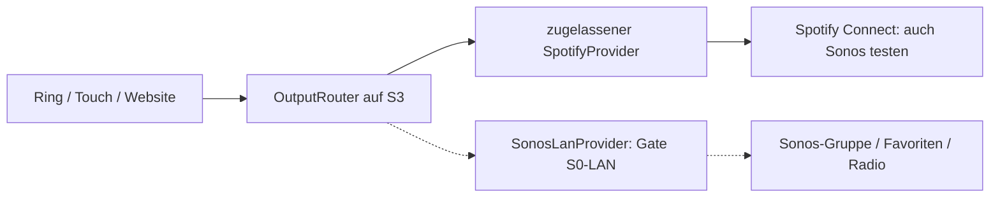

# Sonos: Architekturergänzung und Prüfplan

Stand: 5. Oktober 2026. Auftrag: Sonos-Lautsprecher als weitere Ausgabemöglichkeit prüfen. Architekturprüfung anhand öffentlicher Primärquellen mit erstem Spotify-Laborbefund am Roam; noch kein eigener Sonos-Adapter und keine Vertriebsfreigabe. Kein Home Assistant und kein Music Assistant werden ergänzt.

## Entscheidung

**Zuerst die vom Nutzer benannten Sonos Roam und Move als Spotify-Connect-Ziele testen. Parallel die offizielle Sonos-LAN-Integration für Favoriten, Gruppen und Radio prüfen.** Die LAN-Route passt zum Ziel eines ausschließlich auf dem RotaryKnob laufenden Controllers, ist aber noch kein frei verfügbarer Produktweg. Native Sonos-Steuerung und Radioausgabe sind keine Pflicht der ersten Version. Die öffentliche Sonos-Cloud-API bleibt Quellenvergleich; ein eigener Auth-/Refreshdienst passt nicht zu den [bestätigten Vorgaben](15-OFFENE-PRODUKTENTSCHEIDUNGEN.md) und ist keine aktive Ausweichroute.

| Route | Nutzen | Eigener dauerhafter Server | Status / erstes Gate |
| --- | --- | --- | --- |
| A: Sonos über Spotify Connect | Bestehende Spotify-Inhalte und Steuerlogik auf Sonos nutzen | Keiner zusätzlich zur bisherigen Spotify-Architektur | Zielgerät tatsächlich in zugelassener Spotify-Schnittstelle sichtbar/steuerbar; G0 bleibt |
| B: Offizielle Sonos-LAN-API | Direkte lokale Gruppen-/Favoriten-/ggf. Radiosteuerung | Ziel: keiner | Zugang, sichere Geräteautorisierung, Lizenz und konkrete API-Fähigkeiten schriftlich bestätigen |
| C: Sonos Cloud Control API | Öffentlich dokumentierte Gruppen, Lautstärke, Status und Favoriten | Für das dokumentierte Client-Secret-Modell sicherer Dienst voraussichtlich nötig | Unter aktuellen Vorgaben nicht aktive Umsetzung; nur Quellenvergleich |
| D: Beobachtete lokale UPnP-/SOAP-Wege | Möglicher technischer Vergleich | Technisch oft lokal | Keine zugesagte offiziell unterstützte Vertriebsgrundlage; nicht Produktions-Fallback |

Spotify nennt Sonos ausdrücklich als Connect-Ausgabe. Das belegt die allgemeine Zusammenarbeit, **nicht** die Sichtbarkeit jedes Modells über unsere spätere Controller-Schnittstelle. [Spotify auf Sonos](https://support.spotify.com/us/article/spotify-on-sonos/)

## A. Sonos über Spotify Connect

Ein Sonos-Lautsprecher bleibt im Framework ein `spotify_connect`-Ziel. Ein bloßer Herstellername schaltet keine neuen Fähigkeiten frei. Der zugelassene Spotify-Adapter prüft Gerät, Konto, erreichbaren Zustand, Restriktionen und Lautstärkeunterstützung. Sonos-Zugangsdaten sind für diese Route auf dem Knob nicht zusätzlich vorgesehen. Falls die gewählte Kontokonstellation die Einrichtung von Spotify in Sonos benötigt, führt die Hilfe zur offiziellen Sonos-App.

Zu prüfen: Sichtbarkeit nach Reboot/Standby, Start aus Ruhe, vorhandene Gruppen, Titel-/Coverwechsel, Next/Pause/Volume, konkurrierende Spotify-/Sonos-App-Bedienung, Geräte-ID-Wechsel, Verbindungsverlust und unterschiedliche Konten. Eine Connect-ID darf nicht aus einem Sonos-Playernamen konstruiert werden. Zwei Geräte mit gleichem Namen bleiben getrennt.

Radiostream-URLs werden über diese Route weiterhin nicht spielbar. Sonos-Gruppenbildung wird nicht durch die generische Spotify-Gerätetransferfunktion ersetzt. Ein vorhandener Gruppenverbund kann als Ziel erscheinen; dies ist konkret zu testen, keine universelle Zusage.

## B. Bevorzugter zusätzlicher Prüfpfad: offizielle LAN-Integration

Sonos dokumentiert, dass die LAN Control API nicht allgemein zur Veröffentlichung verfügbar ist. Die öffentlichen Bedingungen unterscheiden interne Evaluation von Veröffentlichung/Distribution und verlangen für Letztere einen gesonderten LAN-Lizenzvertrag. Keine Lizenz wurde hier beantragt oder angenommen. [Sonos-Architektur](https://docs.sonos.com/docs/connected-home-architecture), [Sonos-Bedingungen, Abschnitt 2](https://docs.sonos.com/docs/terms-of-service)

**Gate S0-LAN** muss vor einer Produktimplementierung liefern:

1. Zugang zur offiziell unterstützten lokalen Schnittstelle und passende Veröffentlichungsrechte für diesen Hardwarecontroller.
2. Dokumentierte Authentifizierung/Pairing, Schlüsselbereitstellung, Rotation, Widerruf und Besitzwechsel ohne gemeinsames Firmwaregeheimnis.
3. Freigegebene Discovery, Gruppen-/Statusereignisse und Transportabsicherung für das lokale Netz.
4. Konkrete Unterstützung für Spotify-Favoriten, Podcast-Episoden und Radiowiedergabe; beliebige Radio-Browser-URLs ausdrücklich gesondert klären.
5. Unterstützte Sonos-Softwaregenerationen, Modelle, Gruppenrollen und Grenzen bei Akku-/Bluetooth-Modellen.
6. Anforderungen an Metadatenanzeige, Speicherung, Inhaltsrechte, Updates und Markennutzung.

Die öffentlich dokumentierten Cloud-Endpunkte dürfen nicht einfach gegen eine lokale Lautsprecher-IP aufgerufen werden. LAN-Protokoll, Authentifizierung und Fähigkeiten kommen aus der passenden Freigabe. Eine Communitybibliothek ist kein Ersatz für diesen Nachweis.

Bei bestandenem Gate läuft `SonosLanProvider` auf dem S3. Sonos spielt die Audiodaten selbst; der Knob ist Steuergerät. Ein freigegebener `SonosFavoriteCatalog` kann bereits im Sonos-Haushalt eingerichtete Spotify-Inhalte als lokale Auswahl anbieten. Das könnte einen zusätzlichen direkten Spotify-Login am Knob für **diesen** Pfad vermeiden. Ob dies samt gewünschten Inhalts-/Bedienrechten möglich ist, bleibt Teil der Prüfung; es wird nicht als Umgehung der Spotify-Vorgaben verwendet.

## C. Öffentliche Sonos-Cloud-API: technische Alternative

Sonos erlaubt nach Registrierung und geltenden Bedingungen grundsätzlich die Veröffentlichung einer Cloud-Control-Integration; eine „Works with Sonos“-Zertifizierung ist ein separater Vorgang. Nicht mit den LAN-Lizenzanforderungen vermischen. [Connected Home](https://docs.sonos.com/docs/connected-home-get-started)

Der dokumentierte OAuth-Weg verlangt einen öffentlich erreichbaren HTTPS-Redirect und ein Client Secret für Tokenaustausch **und Refresh**. Eine PKCE-Ausnahme für unseren ausgelieferten Embedded-Client ist in den geprüften Unterlagen nicht belegt. Daraus folgt für unsere Architektur: kein gemeinsames App-Secret in Firmware/Browser und kein rein einmaliger Anmeldedienst als vollständige Lösung; wiederkehrende Tokenpflege braucht einen akzeptierten sicheren Weg. Ein eigener Broker würde das bisherige Betriebsziel erweitern und wird nicht still eingeführt. [Autorisierung](https://docs.sonos.com/docs/authorize)

Events sind optional; HTTPS-Callbacks mit Signaturprüfung sind der empfohlene Weg für Zustandsänderungen. Polling kann einen Eventdienst technisch vermeiden, löst aber weder OAuth-Secretproblem noch Skalierung. Sonos nennt aktuell 1.000 Requests/Minute pro Anwendung insgesamt; dieses Budget wird zwischen Haushalten geteilt. Kein unbegrenztes Polling pro Knob planen. [Subscriptions](https://docs.sonos.com/docs/subscribe), [Quoten](https://docs.sonos.com/docs/quotas-and-spike-arrests)

## Gruppen, Inhalte und Radio

Sonos unterscheidet Haushalt, Player, Gruppe und Wiedergabesitzung. Transportbefehle richten sich an Gruppen; Gruppen-/Session-IDs sind kurzlebig, Player-IDs stabiler. [Control API](https://docs.sonos.com/docs/control)

Unser geplanter Resolver speichert deshalb eine vom Nutzer ausgewählte stabile Playerreferenz als Anker und löst dessen aktuelle Gruppe vor Befehlen neu auf. Bei geänderter Gruppenzusammensetzung zeigt er die betroffenen Räume und fragt für die Erweiterung des Wiedergabeziels im Produkt nach. Keine automatisch neue Gruppe und kein stilles Einbeziehen anderer Räume. Gruppenlautstärke und einzelne Playerlautstärke sind getrennte Einstellungen; die Knob-Lautstärkegrenze schützt nur seine eigenen Befehle.

Öffentliche **Cloud-Belege**, nicht automatisch LAN-Zusagen:

| Fähigkeit | Dokumentierter Weg | Bedeutung für die Prüfung |
| --- | --- | --- |
| Favoriten laden | `POST /groups/{groupId}/favorites` mit `favoriteId` | Sonos-Favorit statt ungeprüfter Spotify-URI; gewünschtes Queue-/Startverhalten explizit |
| Live-Radiostream | `POST /playbackSessions/{sessionId}/playbackSession/loadStreamUrl` | Verlangt offene Playbacksession mit Cloud Queue; kein voraussetzungsloser Universal-URL-Aufruf |
| Kurze Audioeinblendung | `POST /players/{playerId}/audioClip` | Kein Ersatz für dauerhaftes Radio oder den normalen Musikplayer |

`GET /households/{householdId}/favorites` liefert laut öffentlichem Vertrag höchstens 70 Favoriten; nicht abspielbare Pins und Sonos-Playlists sind ausgeschlossen. Der Knob übernimmt nur explizit gewählte Referenzen innerhalb seines eigenen Kataloglimits. [Favoriten lesen](https://docs.sonos.com/reference/favorites-getfavorites-householdid)

`loadFavorite` kann Radiostationen behandeln; Titel-/Playlistfavoriten können die gemeinsame Queue verändern und aktive private Sessions unterbrechen. Vor Umsetzung Queuewirkung und Nutzererwartung festlegen. [Favoriten](https://docs.sonos.com/reference/favorites-loadfavorite-groupid)

`loadStreamUrl` ist ausdrücklich für Live-Radio, nicht für beliebige On-Demand-Tracks. Seine Session-/Cloud-Queue-Voraussetzung muss einschließlich möglicher Content-Service-/Hostinganforderungen geprüft werden. Daraus wird keine automatisch serverlose Radio-Browser-Ausgabe abgeleitet. [Live-Stream](https://docs.sonos.com/reference/playbacksession-loadstreamurl-sessionid)

AudioClips unterstützen bestimmte Dateien/Modelle und haben Unterbrechungssemantik; sie gehören nicht in den Radio-Grundweg. [AudioClip](https://docs.sonos.com/reference/audioclip-loadaudioclip-playerid)

**Radio zuerst über vorhandene Sonos-Radiofavoriten prüfen**, danach freie Radio-Browser-URLs als eigenes Gate S-RAD-02. Der Spieler lädt den Stream selbst. Kein Audio-Proxy, Transcodingserver oder Stream über UART wird eingeführt. Erreichbarkeit und Codec müssen vom Lautsprecher aus funktionieren. Sonos-Renderer erlauben keinen automatischen Zugriff auf Radio mit jedem beliebigen Codec/URL.

Die offizielle manuelle Einrichtung eigener Radiostreams in Sonos erfolgt über TuneIn. Das ist ein zusätzlicher Einrichtungsweg mit Konto/App/Dienst; ein TuneIn-Favorit ist nicht automatisch eine von unserer Sonos-Favoritenabfrage gelieferte Referenz. [Sonos-Anleitung](https://support.sonos.com/en/article/use-tunein-to-add-internet-radio-station-urls-to-sonos?language=en_US)

## Erweiterung der internen Architektur

Geplante neue Verantwortung: `OutputRouter` bindet **eine** Steuerautorität pro Sitzung. Derselbe physische Sonos-Raum kann über Connect und Sonos sichtbar sein, soll aber nicht von beiden Adaptern gleichzeitig Befehle bekommen. Routenwechsel erhöht die lokale Generation, verwirft alte Befehle und holt einen frischen Snapshot. Die Zuordnung einer Spotify-Geräte-ID zu einer Sonos-Player-ID benötigt bestätigte Identität; gleiche Namen genügen nicht. Ein fehlgeschlagener Connect-Befehl löst keinen stillen Sonos-Fallback aus. Eine fremde Sitzungsübernahme wird im Zustand angezeigt; der Knob erzwingt nicht automatisch eine neue eigene Sitzung. Der neue Anbieter benutzt die bereits vorgesehenen gebundenen Kommandos/Snapshots, nicht einen zweiten UI-Zustand.

Vor einem Vertragsupdate nach S0 vorgesehen:

- `route`: Spotify Connect / nachgewiesenes Sonos LAN, getrennt von Hersteller/Modell; kein Cloud-Adapter im aktuellen Umsetzungsumfang.
- `household_ref`, `anchor_player_ref`; aktuelle Gruppe nur als flüchtiger Resolverzustand.
- `sonos_favorite_ref` als eigener, haushaltsgebundener Inhaltstyp; nicht in `spotify_uri` verstecken.
- Fähigkeiten separat: Gruppe steuern, Favorit starten, Episode starten, vorhandenen Radiofavoriten starten, freie Stream-URL, Gruppen-/Einzellautstärke.
- Autorisierungs- und Freigabestatus aus verifizierter Gerätesitzung/Buildprofil; nie über Benutzer-JSON selbst freischalten.

Die aktuelle JSON-/C++-/Python-API erhält in dieser Prüfphase keine vorgetäuschte Sonos-Fähigkeit. Erst ein belegter Adapterpfad führt zur abgestimmten Schema-/API-Version mit Migrations- und Ablehnungstests. `vendor_radio` allein bedeutet bislang nicht „Sonos verfügbar“.

## Onboarding und Website

1. „Ausgabe hinzufügen“ bietet nach verfügbarer Fähigkeit Spotify Connect oder den freigegebenen Sonos-Pfad.
2. Connect: freigegebener Spotify-Anmeldeweg ohne eigenen externen Dienst und tatsächlich sichtbare Geräte. Sonos LAN: partnerdefiniertes lokales Pairing; noch keinen erfundenen Knopfdruck-/Tokenflow anzeigen. Kein Cloud-Onboarding unter aktuellen Vorgaben.
3. Haushalt und Raum wählen; betroffene Gruppenmitglieder anzeigen. Keine Zusammenführung nur nach Namen.
4. Sonos-Favoriten freigeben; für das Spotify-Produkt andere Musikdienste nicht pauschal importieren. Dienstzuordnung verifizieren, unbekannte Quellen gesperrt lassen; Radio gesondert freigeben.
5. Testwiedergabe nach Nutzeraktion. Fehler „Raum schläft“, „Konto getrennt“, „Favorit entfernt“, „Gruppe geändert“ unterscheiden, soweit Adapterdaten dies belegen.

Sonos-Musikdienst-Zugangsdaten bleiben im Sonos-System; der Knob liest keine Spotify-Secrets aus Sonos aus. Ob Sonos-Konto und direkt verknüpftes Spotify-Konto zu derselben Person gehören, darf nicht aus Anzeigenamen angenommen werden. Metadaten nur nach jeweils erlaubten Speicher-/Darstellungsregeln behandeln. Keine Zertifizierungslogos ohne Zertifizierung.

## Konkreter Prüfablauf

| Gate | Prüfung | Nachweis vor Freischaltung |
| --- | --- | --- |
| S-CONNECT | Vorhandene Sonos Roam und Move über zugelassenen Spotify-Weg | Generation/Firmware, Sichtbarkeit, Start, Lautstärke, Metadaten und Reconnect pro Modell |
| S0-LAN | Offizieller Zugang, Authentifizierung und Distribution | Geeignete Unterlagen/Lizenz, kein gemeinsames Firmware-Secret |
| S-FAVORITE | Spotify-Playlist und Podcast als Sonos-Favorit | Gewünschter Inhalt, Queue-/Startwirkung, Konto-/Dienstrechte |
| S-RAD-01 | Sonos-Radiofavorit | Dauerbetrieb, Lautstärke, Metadaten und Stop |
| S-RAD-02 | Eigene Radio-Browser-URL | Unterstützter API-Pfad samt Sessionvoraussetzungen; Codec, Redirect und Erreichbarkeit |
| S-GROUP | Gruppierung während laufender Bedienung | Stabile Ankerzuordnung, keine unerwarteten Räume, veraltete Events verworfen |
| S-ROUTE | Derselbe Player über zwei Adapter | Keine Doppelbefehle oder Rückmeldeschleifen |
| S-MODEL | Generation/Modell/Firmware/Standby | S1-/aktuelle-Systeme getrennt; portable Modelle WLAN/Bluetooth/Schlafmodus gesondert testen |
| S-CLOUD | Falls ausdrücklich weiterverfolgt | Sicherer Refresh-/Eventweg und appweites Budget; Betriebsabweichung akzeptiert |

Testmatrix zunächst: vorhandener **Sonos Roam und Sonos Move**, genaue Generation/Firmware jeweils erfassen; zwei geplante RotaryKnobs desselben Typs wie im Hauptprojekt. Einzelraum und vorhandene Gruppen prüfen, portable Geräte in WLAN/Bluetooth/Standby getrennt beobachten. Ein stationärer Sonos-Player, S1-Geräte und weitere Hersteller sind keine bestätigte Testhardware und gehören gegebenenfalls zur späteren Erweiterung. S1- und aktuelle Sonos-Systeme lassen sich nicht gemeinsam gruppieren. Bei portablen Geräten kann Battery Saver das Gerät vollständig ausschalten; daraus folgt kein vom Knob nachgewiesener Aufweckweg. [Getrennte Systeme](https://support.sonos.com/en-ie/article/known-limitations-with-separate-s1-and-s2-sonos-systems), [Akkueinstellungen](https://support.sonos.com/en/article/battery-settings-for-portable-sonos-products)

Keine pauschale Bluetooth-/Wake-on-LAN-Zusage. Keine Geräte wurden für dieses Dokument angesprochen.

**Mögliche Abschlussentscheidungen nach Geräte- und Zugangsprüfung (alle noch offen):** Sonos als Connect-Ziel bestätigt / LAN-Adapter genehmigt und technisch belegt / Cloud-Alternative separat beschlossen / fehlende Fähigkeiten erklärt gesperrt. Der Sonos-Zweig verändert weder die S3-/ESP32-Aufteilung noch den Zwei-Image-OTA-Prozess.

## Laborbefund 5. Oktober 2026

Beim vom Nutzer bestätigten Roam-Betrieb liefert Spotify in vier gültigen
Playbackantworten laufende Wiedergabe, aber keine adressierbare aktive Geräte-ID
und `is_restricted=true`. Der aktive Player lässt sich keinem der drei gelisteten
Geräte zuordnen. Damit ist Route A für diese Sitzung als steuerbare Ausgabe
nicht nachgewiesen; die Einschränkung erklärt die fehlende Steuerbarkeit.
Nach [Spotify-Referenz](https://developer.spotify.com/documentation/web-api/reference/get-information-about-the-users-current-playback)
akzeptiert ein so markiertes Gerät keine Web-API-Befehle. Namenloser Listeneintrag
und Roam werden nicht gleichgesetzt; keine Verallgemeinerung auf alle Sonos-
Modelle, Firmwarestände oder Konten. Belege und zusätzlich beobachtete HTTP-
Abbrüche: [Native Geräteprüfung](16-NATIVE-IMPLEMENTIERUNG.md).

Nächste Prüfaufgaben: Titelanzeige separat bestätigen, generischen Spotify-
Steuerpfad an einer tatsächlich adressierbaren Ausgabe abnehmen und für Sonos
Gate S0-LAN klären. Eine rein lokale interne Evaluation von Discovery/Status ist
von Produktimplementierung und Vertriebsrechten zu trennen. Keine Umgehung der
Spotify-Sperre durch globale Befehle und kein stiller Wechsel zu Sonos-Steuerung.
