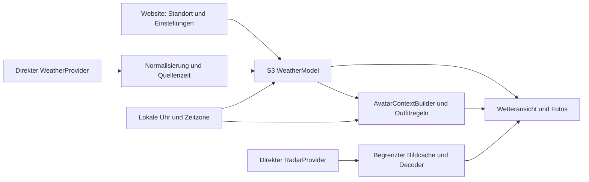

# Wetter, Radar und Avatar ohne Home Assistant

Stand: 30. September 2026. Wetter einschließlich der bestehenden Radar- und Avatarbedienung gehört ausdrücklich zur Spotify-Edition. Dieses Dokument konkretisiert P10/P11 im [Implementierungsplan](08-IMPLEMENTIERUNGSPLAN.md). Es beschreibt geplante Implementierung, keine bereits vorhandene Gerätefirmware. Es wurden keine Anbieterregistrierungen, Abonnements, Partneranfragen oder Geräteänderungen ausgeführt.

**Verbindliche Produktvorgaben:** Deutschland zuerst (Q04), keine laufenden Wetter- oder Radaranbietergebühren (Q05), Wettervorhersage, Wetterbilder und Avatar in der ersten Version; Radar und seine Metadaten folgen nach Qualifikation (Q06). Der Pilot beginnt mit zwei Knobs (Q09), überwiegend am USB-Netzteil mit erreichbarer Website und Steuerung (Q07). Die Antworten stehen im [Entscheidungsregister](15-OFFENE-PRODUKTENTSCHEIDUNGEN.md). Kostenfreie Quellen müssen die geplante kommerzielle Produktnutzung erlauben; ein kostenloses Privatangebot erfüllt diese Vorgabe nicht. Radar bleibt im vollständigen Portumfang, blockiert aber die erste Version nicht. Datenanbieter, Feldabdeckung und Hardwareleistung sind weiterhin nachzuweisen.

## 1. Übernehmen und neu aufbauen

Referenz ist Commit `9cc5576c2fd4a9beb56cad24e211957c43aa2c62`, siehe [Quellkarte](06-UPSTREAM.md) und [Featuretabellen](13-FEATURE-PORTIERUNG.md). Darstellungen, Outfitregeln und lokale Zeitlogik sind überwiegend wiederverwendbar. HA-Wetterentity, Python-Aufbereitung, externe Regenmetadaten und bisheriger Radarrenderer werden durch eigene S3-Komponenten ersetzt.

| Funktion | Problem | Kurze Umsetzung |
| --- | --- | --- |
| Temperatur, Condition, Feuchte, Wind, gefühlt | HA liefert bislang Werte; kein eigener Wettersensor belegt | Direkter Wetteradapter, Einheiten und Gültigkeit pro Feld; gefühlt nur aus passenden vollständigen Eingaben |
| Tagesansicht und Vorhersage | Alte Parser ersetzen fehlende Werte teils durch scheinbar echte Daten | Maximal 48 Stunden und 5 Tage; lokale Tagesgrenzen, Nullwerte und echte Min/Max erhalten |
| Morgen/Mittag/Abend/Nacht | Bisher Zielzeiten 08/13/19/23 Uhr, unsichere Zuordnung | Nur Werte des richtigen lokalen Tages mit definiertem Zeitabstand auswählen |
| Regenhinweis | Stundenforecast erzeugt bisher minutenartig formulierte Texte | Auflösung ausdrücklich anzeigen; unbekannt bleibt unbekannt, nicht „Kein Regen“ |
| Wetter-Screensaver | 15 Rohbilder benötigen viel Flash | Lokale komprimierte Originalmotive, Uhr-/Textlayer, Fade/Boost und Kontrastregeln portieren |
| Outfit-/Morgenavatar | Wetterkontext kommt vom HA-Broker | Natives `AvatarContextBuilder`, vorhandene deterministische Regeln, Haarwahl und Zeitplan |
| Radar | Mitgelieferte Serverkonfiguration enthält keinen vollständig reproduzierbaren universellen Drei-Zoom-Renderer | Direkte zulässige Bildquelle, lokale Aufbereitung und drei qualifizierte Zoomstufen |
| Regen-ETA, Zugrichtung und Geschwindigkeit | Stammt aus externen Rain-Warner-Daten | Eigener Metadatenadapter nach W-RAD-META; andernfalls diese Angaben als nicht verfügbar behandeln |

Die bestehende Radaransicht zeigt ein **Standbild**, keine Animation. Timeline, Pause und Filmwiedergabe sind spätere optionale Erweiterungen. Gewitter-/Hagelhinweise des Avatars sind keine amtlichen Warnmeldungen; ein CAP-Warnfeed wäre ebenfalls eine zusätzliche Funktion.

## 2. Gerätearchitektur

Der S3 besitzt sämtliche Wetterlogik, Website und Zustände. Der Companion erhält keinen zweiten Katalog oder Wettercache. Externe Wetterdienste liefern Daten; ein eigener dauerhaft laufender Server, HA oder MA wird nicht benötigt. Die Vorhersagemodelle selbst laufen beim Wetteranbieter.

`WeatherSnapshot` enthält Quelle, Standortrevision, Modelllaufzeit soweit verfügbar, Zeitpunkt der erfolgreichen Quellenprüfung, Gültigkeitsintervalle, Feldgültigkeit und Einheiten. Aktuelle modellbasierte Werte werden nicht als lokale Messung ausgegeben. `RadarSnapshot` besitzt eigene Quellen-/Bildzeit und eigene Fähigkeiten. Standortwechsel invalidiert laufende Wetter-, Radar- und Avataraufträge. UI und Website verwenden denselben Zustand.

Eine priorisierte Arbeitswarteschlange hält Eingabe und Medienbefehle vor Wetter, Cover und Radar. Netzwerk, Parsing und Decode laufen außerhalb des UI-Threads; nur dieser verändert LVGL-Objekte. Höchstens ein großer Bilddecode läuft gleichzeitig. OTA unterbricht nicht notwendige Downloads.

## 3. Datenanbieter und Entscheidung

**Erste Priorität: DWD MOSMIX_L für eine Einzelstation in Deutschland.** Der Spike prüft eine direkte, schlüssellose Lösung ohne laufende Anbietergebühren. **Zweite Priorität: MET Norway**, sofern Feldabdeckung, direkte Gerätenutzung, kommerzielle Rechte und Flottenregeln nachgewiesen sind. Die endgültige Wahl fällt nach W0 und Ressourcenprobe; kein Anbieter wird durch diesen Plan bereits aktiviert. Open-Meteo Customer ist wegen Q05 aus der aktiven Planung ausgeschieden. Die bisherigen Quellen bleiben als dokumentierter Vergleich erhalten.

| Quelle | Vorteil | Offene Arbeit / Produktgrenze |
| --- | --- | --- |
| DWD MOSMIX_L — zuerst prüfen | Direkte Einzelstationsdaten, kein gemeinsamer privater API-Key notwendig | KMZ/ZIP und XML streamend verarbeiten; Stationsauswahl, Feld-/Zeitmapping, Aktualisierung und konkrete entgeltfreie Nutzungsrechte prüfen |
| MET Norway — gebührenfreie Alternative prüfen | Schlüsselloses JSON; vorhandener Avatar kennt dessen Intervallmodell | Kommerzielle Nutzung, identifizierender User-Agent, direkte Clientlast und Cache-/Flottenregeln; verfügbare Felder variieren |
| Open-Meteo Customer — verworfene Kostenoption | Selektives JSON für aktuelle, stündliche und tägliche Werte einschließlich gefühlt, Regenwahrscheinlichkeit und Sonnenzeiten | Kommerzieller Tarif widerspricht Q05; kein aktiver Implementierungsspike und keine Nutzung der FreeAPI als kommerzielle Ausweichlösung |

DWD beschreibt MOSMIX_L mit vier Läufen täglich, bis 240 Stunden und Einzelstationsdateien; das KML-Format ist XML mit Erweiterungen. Nur eine passende Station und benötigte Werte lesen, keine Datei aller Stationen. Stationsname und Entfernung gehören zur Quellenanzeige. Fehlwerte, Niederschlagsintervalle und Umrechnung werden anhand der tatsächlichen Parametertabelle implementiert. [DWD-Verfahren](https://www.dwd.de/DE/leistungen/met_verfahren_mosmix/mosmix_verfahrenbeschreibung_gesamt.pdf?__blob=publicationFile&v=4), [DWD-Format](https://www.dwd.de/EN/ourservices/met_application_mosmix/mosmix_kml_format_description.pdf?__blob=publicationFile&v=4)

Entgeltfreie DWD-Leistungen stehen unter CC BY 4.0 mit Quellenvermerk; die Lizenz erlaubt kommerzielle Nutzung. Ausgewählte Datensätze und Kartenbestandteile müssen dennoch konkret zugeordnet werden. Lizenzfreiheit bedeutet keine garantierte Verfügbarkeit. [DWD-Nutzungsrechte](https://www.dwd.de/SharedDocs/downloads/DE/allgemein/preisliste_2024.pdf?__blob=publicationFile&v=21), [CC BY 4.0](https://creativecommons.org/licenses/by/4.0/deed.de)

**Vergleich, nicht zur Umsetzung ausgewählt:** Open-Meteo stellt den kommerziellen Endpunkt `customer-api.open-meteo.com` mit API-Key bereit. Die kostenlose API schließt kommerzielle Produktintegration aus; umfangreiche Variablenabfragen können mehrfach auf das Callbudget zählen. Der kostenpflichtige Customer-Weg entfällt durch Q05. Weder ein vom Käufer bezahlter Kundenkey noch ein geteilter Rechnungsschlüssel in der Firmware ist ein geplanter Ersatz. Ein eigener Authproxy wird nicht eingeplant. **W-AUTH** bleibt nur ein bedingtes Gate, falls später eine gebührenfreie, kommerziell zulässige Quelle einen Schlüssel erfordert: zulässige Ausgabe, Widerruf und Rotation ohne gemeinsames Firmwaresecret nachweisen. [Tarife](https://open-meteo.com/en/pricing), [Bedingungen](https://open-meteo.com/en/terms)

MET Norway verlangt unter anderem Produktidentifikation, HTTPS, Cache-Header, zeitlich verteilte Abfragen und begrenzte Koordinatenpräzision. Mehr als 20 Requests pro Sekunde für die **gesamte Anwendung** benötigt eine Vereinbarung; für hohe direkte Clientlast ist der Proxybedarf zu klären. Deshalb kein unbegrenzt skalierbarer Ersatz ohne Produktprüfung. Zunächst zwei Pilotgeräte und anschließend die geplante Erweiterung getrennt bewerten. Falls direkter Betrieb einen eigenen dauerhaften Proxy oder laufende Anbietergebühren voraussetzt, erfüllt dieser Weg die Produktvorgaben nicht. [Lizenz](https://api.met.no/doc/License), [Nutzungsvorgaben](https://api.met.no/doc/TermsOfService)

## 4. Zeitsemantik, Cache und Avatar

Maximal **48 Stundenwerte und 5 Tageswerte** halten; die bestehende UI zeigt davon Tagesabschnitte und zwei kommende Tage. Fehlende Temperatur, Regenwahrscheinlichkeit oder Tageswerte bleiben ungültig. Wahrscheinlichkeit darf weder aus Regenmenge erfunden noch über Stunden summiert werden.

Jeder aktive Adapter normalisiert seine Daten vor Aggregation in explizite Intervalle; die tatsächliche DWD-Parametertabelle ist dafür im Spike zu prüfen. MET `next_1_hours` bezieht sich auf die Stunde ab Zeitstempel. Zum erhaltenen Vergleich: Open-Meteo-Stundenniederschlag bezieht sich auf die vorangegangene Stunde, begründet aber keinen weiterhin geplanten Open-Meteo-Adapter. UTC intern, Zeitzone nur für Anzeige/Tageszuordnung; Sommerzeit mit 23-/25-Stunden-Tagen testen. [Open-Meteo-Felder](https://open-meteo.com/en/docs), [MET-Zeitmodell](https://api.met.no/doc/ForecastJSON)

Avatarregeln bleiben erhalten: vier vollständige Prognosestunden mit belegter Intervallsemantik, keine Lücken oder Doubletten; andernfalls ausreichend aktuelles „Jetzt“ oder neutraler Avatar. Avatar-Kontextgültigkeit **20 Minuten seit verifizierter Quellenprüfung/Aggregation**; Transportwiederholung oder erneutes Rendern erneuert sie nicht. Im Modus `CURRENT` muss zusätzlich die zugrunde liegende Beobachtung höchstens 20 Minuten alt sein. Im Modus `FORECAST` gilt keine pauschale 20-Minuten-Grenze für den Modelllauf: dessen Gültigkeit ist anbieterabhängig und das Vierstundenfenster muss passen. Allgemeine Wetteransicht und Radar erhalten eigene quellenabhängige Frische-/Veraltetgrenzen; die zentrale Statuslogik ist eine bewusste Erweiterung. Quellenprüfung und Modelllauf sind getrennte Zeitpunkte: eine unveränderte Prognose ist kein neuer Modelllauf. Eine HTTP-304-Antwort kann nur nach definiertem Quellenvertrag die erfolgreiche Prüfung bestätigen, niemals Datenzeit/Gültigkeit erfinden. Der DWD-Spike muss Cache-/Prüfintervall und 20-Minuten-Regel gemeinsam qualifizieren; bei fehlender aktueller Evidenz neutral anzeigen.

Die sechs Temperaturbänder, Nässeschutz, Wind-/Böenregeln, Schnee und Sonnenschutz werden als reine Funktionen portiert. Haarwahl bleibt unabhängig vom Wetter. Morgenautomatik standardmäßig 06:00 bis vor 10:00 Uhr; ein frei wählbares Zeitfenster wäre eine Erweiterung. Aktive Bedienung, Setup, Modalansichten und OTA haben Vorrang. Der für die erste Version gewählte USB-Normalbetrieb erhält Website und Netzwerk auch bei ausgeschaltetem Display. Ausdrücklicher Tiefschlaf macht das Gerät offline; er ist kein automatischer Standard und keine Voraussetzung für die erste Wetterlieferung.

## 5. Radar und Regenmetadaten

**Nachlieferung gemäß Q06:** Radarbild und Regenmetadaten werden nach dem ersten Lieferstand qualifiziert und ergänzt. Offene Radargates bleiben dokumentiert; sie werden weder als bestanden gezählt noch aus dem Gesamtumfang gestrichen. Für Deutschland zuerst einen gebührenfreien, kommerziell zulässigen DWD-WMS-Weg prüfen: aktuelle `GetCapabilities`, Radar-Layer, Zeitdimension, Projektion, Gebiet und Rechte bestimmen; anschließend kleinen `GetMap`-Ausschnitt direkt laden. Die offiziellen Beispiele belegen den WMS-Bildweg, aber keine hier bereits geprüfte heutige Radar-Layer-/Nowcastkombination. Diese Probe steht aus. [DWD-Geodienste](https://www.dwd.de/DE/wetter/warnungen_aktuell/objekt_einbindung/einbindung_karten_geodienste.pdf?__blob=publicationFile&v=14)

**RainViewer bleibt ausschließlich im Quellenvergleich.** Ohne belegten gebührenfreien Weg für die kommerzielle Produktintegration ist es kein aktiver Ersatz gemäß Q05. Die Transition-Dokumentation nennt seit Januar 2026: keine Zukunftsradar-/Satellitenbilder, Universal Blue, maximal Zoom 7 und 100 Requests/IP/Minute. Der dokumentierte Bilddienst bietet einen zweistündigen Rückblick in Zehn-Minuten-Schritten und 256-/512-Pixel-PNGs. Ältere widersprüchliche FAQ-Aussagen sind keine Nowcastzusage. Die kommerziellen Nutzungsrechte und Gebührenfreiheit sind hier nicht nachgewiesen; ein kostenpflichtiger Zugang wird nicht eingeplant. [Änderungen](https://www.rainviewer.com/api/transition-faq.html), [Bildformat](https://www.rainviewer.com/api/weather-maps-api.html), [Bedingungen](https://www.rainviewer.com/api.html)

Die Portierung erhält 320×320-Bildfläche, Touch-/Ringzoom, drei Zoomstufen und atomaren Bildwechsel. Frühere Kilometerlabels 264/132/66 werden erst nach geografischer Prüfung übernommen. Ein fehlendes Bild darf das letzte Bild mit sichtbarem Alter stehen lassen. Kartenuntergrund erhält eigene Lizenzprüfung; keine automatische Abhängigkeit von frei angenommenen Kartenservern.

**W-RAD-META:** Regenbeginn, Zugrichtung und Geschwindigkeit benötigen einen nachgewiesenen direkten Metadatenanbieter oder eine gesondert geprüfte Bewegungsanalyse. Windrichtung ist keine Radarzugrichtung; ein Standbild liefert keinen Bewegungsvektor. Stundenforecast liefert keinen minutengenauen Nowcast. Ohne Nachweis bleiben diese Angaben offen und werden nicht simuliert. Radarfilm/Timeline ist kein Pflichtport der heutigen Standbildbedienung.

## 6. Ressourcen, Website und Abnahme

| Bestandteil | Quellwert oder Startbudget | Umsetzung |
| --- | ---: | --- |
| 15 Wetter-JPEGs | 361.439 Bytes statt 4.062.720 Bytes RGB565 | Komprimiert im signierten S3-Appimage bevorzugt |
| Deduplizierte Avatar-JPEGs | 549.141 Bytes | Deduplizierung und Herkunft erhalten |
| Avatar-Doppelbuffer | 541.696 Bytes, zuzüglich Decoder | PSRAM, gemeinsamer Decode-Scheduler |
| Radar-Doppelbuffer 320×320 RGB565 | 409.600 Bytes, zuzüglich Quelldaten | Inaktive Ansicht freigeben; keine unbegrenzte Framehistorie |
| Normalisierte Wetterdaten | Ziel 4–16 KiB, höchstens 48 Stunden/5 Tage | Feste Grenzen und Feldgültigkeit |
| JSON-Empfang | Startgrenze 128 KiB entpackt | Streamend filtern; DWD-KMZ/XML separat dimensionieren |

Budgets sind keine Messung oder Zusage, dass alle Puffer gleichzeitig passen. ZIP-Ausgabe, Bilddimensionen und Decoderarbeit begrenzen; beschädigte/übermäßig komprimierte Dateien abbrechen. Originale Wetterbilder mit 368×368-Overscan erhalten. Erst vollständige A/B-Größen rechnen: Web, Fonts, Firmware, Wetter-/Avatarassets, Journal und NVS. Falls separate Assets nötig sind, müssen Version, Signatur und Rollback zusammen mit der App funktionieren. Siehe [OTA](05-OTA-SICHERHEIT.md).

Website: Wetter aktivieren, Ort/PLZ oder Koordinaten, Anzeigename, Zeitzone, Anbieter, Einheiten, Avatarhaar/Morgenautomatik sowie Frische und Attribution. Ortssuche ist eine gesonderte Dienstentscheidung; manuelle Eingabe bleibt möglich. Kein belegtes GPS voraussetzen. Nur erforderliche Standortpräzision übertragen; direkt angefragte Anbieter sehen IP und Standortparameter. Standort im Supportexport optional entfernen, API-Keys immer ausschließen. Reset löscht Standort und Credentials.

| Gate | Konkreter Nachweis |
| --- | --- |
| W0 / P10.1 | Deutschlandabdeckung, Felder, kommerzielle Nutzung ohne laufende Anbietergebühren, Attribution und direktes Standort-/Abfragekonzept belegt |
| W-AUTH | Nur falls eine nach Q05 zulässige gebührenfreie Quelle Schlüssel benötigt: Ausgabe, individueller Betrieb und Rotation ohne geteiltes Firmwaresecret belegt |
| W1 / P10 | Vor erster Version: reale Wetter-/Avataranzeige, Frische/UTC/DST/Nullwerte, Settings und Mischlast des gelieferten Umfangs physisch bestanden |
| W-RAD-0 / P11.1 | Vor Radarnachlieferung: kommerzielle Quelle ohne laufende Anbietergebühren, Kartenrechte und aktuelle Formate/Deutschlandabdeckung/Quoten nachgewiesen |
| W-RAD-META | Direkte ETA-/Vektordaten einschließlich Aktualität und Semantik belegt |
| W-RAD-1 / P11 | Vor Radarnachlieferung: drei Zooms, Standortwechsel, Bildalter, Decode/Offline/Ressourcen und erneute gesamte Mischlast mit Radar nachgewiesen |

Zuerst Snapshotvertrag und Fixtures, dann DWD-Spike; bei Bedarf MET Norway als passende gebührenfreie Alternative prüfen. Anschließend Wetteransichten, Avatar und Assets für die erste Version integrieren. Deren reale Mischlast umfasst schnelles Drehen, Spotifyzustand, jederzeit erreichbare Website, Wetterabruf und Avatarwechsel; zusätzlich Netzverlust, falsche Uhr und Stromausfall beim Save/OTA prüfen. Der Pilot startet mit zwei Knobs. Radar folgt mit eigenen Daten-/Metadatengates und erneuter vollständiger Ressourcen- und Mischlastabnahme einschließlich Radar. Die Produktentscheidungen Q04–Q07/Q09 sind beantwortet; die technischen Produkt-/Hardwaregates bleiben offen. Prüfungen richten sich nach dem [Abnahmekatalog](09-ABNAHME.md); Quellenanalyse ersetzt keine Gerätebeobachtung.
